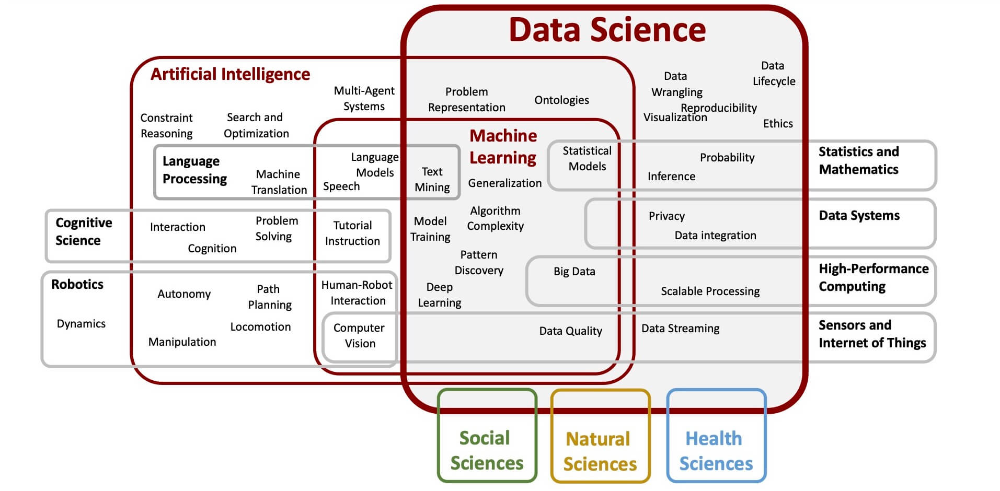

\mainmatter

# Introduction {#introduction}

## What is data science? {#data-science}
Data science degree and certificate programs have sprouted at academic institutions around the country, while books, articles, and conference programs about data and how to analyze it regularly appear in library conference programs and educational events. The increased visibility of data science belies the fact that data science has been around for a while. Indeed, data collection and the need to make sense of it is not new. R, the programming language used in this book, has been around for decades. However, experts have some back-and-forth about the discipline of data science and its relationship to other subjects.

Rather than take sides, this book takes a broad view of what constitutes data science and highlights five interdependent elements. These include both **mathematics** and **statistics** on the computational side. With or without a graphical user interface, data science is made real through **computer programming**. Practitioners of data science bring extensive **subject matter knowledge**. Their expertise enables them to communicate their conclusions through data **visualizations**, often providing pictures that speak louder than numbers.

Data science is a discipline that extracts knowledge from data in various fields, including librarianship. While data science can help make decisions, it is not a substitute for human decision-making. It can provide insights and generalizations from collected observations (data). Aspects of some subjects remain unquantifiable yet comprehensible to human interpretation. Data analysis is fallible; it requires data science practitioners to bring their expertise to bear on interpretation and decision-making.

Whether we realize it or not, data science is a broad discipline that saturates our professional lives. For academic librarians,  faculty, staff, and students learn and perform data science tasks daily, such as data cleaning, management, and visualizations.  This occurs in computational science disciplines as well as the biological, physical, social sciences, and even in the humanities. In addition, librarians can act as data curators who help researchers publish or deposit their data to data repositories and academic journals. 

Corporations and other institutions with special libraries likely have teams using many tools to analyze the market or user behavior. Predictive text in search engines relies upon text mining and machine learning. Humanities and social science professionals use maps, analysis, web scraping, and text mining to create and analyze datasets. These disciplines need to communicate their findings through written reports and dashboards for their stakeholders and constituents. Data science also permeates the public sphere. Users are subject to machine learning algorithms in their daily lives within loan applications, resume screenings, social media feeds, news visualizations, public health data, social services eligibility, and medical care. Public librarians interact with patrons whose complex information needs may result from how data science impacts their lives. Data literacy is required when data science provides input for human decisions, particularly when those decisions affect others' well-being. 

## Why learn data science? {#learn-ds}
Librarians have long collected metrics about their collections and their patrons. However, the pervasiveness of data collection and the need to justify or rationalize library expenditures creates an environment that data science can exploit in the best interests of library and information professionals. Because librarians are both consumers of data and teachers of data literacy, they must acquire skills to perform data science and interrogate data analyses to determine their veracity.

Data literacy is the ability to read, interpret and analyze data, and it is a requirement when people use data to distort the truth^[https://royalsocietypublishing.org/doi/10.1098/rsos.190161]. Unfortunately, data literacy is both a necessary and frequently needed skill. Data science enables data literacy and democratizes access to the source material; so much of our personal and professional lives are affected by data, whether created or influenced by data-driven decision-making. Data provides valuable information to help experts make decisions. Beyond just the economy, so much in our society rewards data literacy and penalizes the illiterate. Because of this, data is too valuable to be left only to data scientists, computer scientists, or statisticians. Instead, subject experts need to learn to code because they know their data best and are best suited to analyze it and draw healthy and accurate conclusions. Your professional expertise lets you ask the right questions and interpret meaning from the data. When experts in their field add data science skills to their repertoire, data science is further democratized^[https://www.rstudio.com/resources/rstudioconf-2020/data-science-education-in-2022/], and data-driven decisions are more impactful. 

## Why use code? {#use-code}
Ever the proponents of literacy, librarians have embraced data literacy and data-driven decision-making for many years. Conference sessions to improve both data collection and analytics presentation abound. When data skills are adopted, it is usually in the context of a commercial spreadsheet or analytics program. Learning to code is not as common among library and information professionals; this book argues that learning to code is doable and provides increased utility and impact. In the long run, learning a programming language for data science is best because it is accessible to all, ensures data analysis is reproducible, and it is future-proof as applications change.

If we define programming as being able to talk to computers in a language they understand, then most librarians have already done that and are probably quite good at it. Technical services and cataloging librarians will be familiar with MARC (Machine Readable Cataloging), the special syntax libraries use to catalog their collections so that computer software can read. More commonly, if you've written formulas in a spreadsheet application, you've dabbled in the basics of computer programming. However, learning to code offers far greater applications and versatility than a spreadsheet application.  

The core benefits of doing data science in code are interoperability and reproducibility. Many academic librarians will be familiar with FAIR Principles^[https://www.go-fair.org/] through their data curation work; this initiative focuses on making information Findable, Accessible, Interoperable, and Reproducible. Doing data science in code ensures that data and data analysis are both interoperable and reproducible, neither of which is possible with proprietary software applications.

Interoperability requires that other librarians who may have completely different software applications on their computers would be able to run anyone else's code. The R programming language is an open-source tool that is free to anyone across the globe and provides transparent data analysis. Additionally, platform-agnostic tools like coding can bring together the output of multiple commercial products to rationalize and analyze the data together.

Reproducibility is closely related to interoperability because code should run on any application configuration. Still, the analysis must be able to be re-run by another person and get the same results. In the past few years, there have been stories in the news about errors in spreadsheet applications that allowed researchers to draw erroneous conclusions. In one case, years of austerity measures around the globe rested on one economics research paper that was missing a few values for some variables^[https://www.businessinsider.com/thomas-herndon-michael-ash-and-robert-pollin-on-reinhart-and-rogoff-2013-4].  Using code allows researchers to combine their data, code, and analysis, providing transparency into the process of data science.  Unfortunately, there have other examples of reproducibility problems in various scientific disciplines: physics^[https://physicstoday.scitation.org/do/10.1063/PT.6.1.20180822a/full/], psychology^[https://www.science.org/doi/10.1126/science.aac4716], and medical research^[https://journals.plos.org/plosbiology/article?id=10.1371/journal.pbio.1002165] as well. A librarian will need to re-run their analyses on new iterations of data without replicating the data cleaning and analysis steps manually. Thankfully, code can be run repeatedly with new data as input, saving hours and hours while repeating each step precisely.  The ultimate benefit of doing data science using computer programming languages is the ability to share raw data and the steps for analysis.

## Vignette {#vignette}
This book creates an overarching narrative that presents realistic code examples and valuable outputs centered around a hypothetical outreach librarian in St. Louis, MO. Envision that you are this outreach librarian and you want to create a partnership with community institutions to address unemployment in St. Louis. Your goal is to present a report to stakeholders at the library and within the community that analyzes several data sources related to employment and unemployment in St. Louis. You will employ different data science skills to compile the report. Each chapter in this book will touch on a different aspect of her report, building upon each other to learn data science and code each analytical section in R.

The reader is invited to inhabit the role of this librarian, who we will address as 'you' throughout the book as we introduce each chapter with a scenario that describes what the librarian is trying to accomplish with each data science skill.

## Structure of this book {#book-structure}
In pursuit of data to justify a community partnership, you will learn R in incremental steps with a topic for each chapter that will produce one aspect of the final report. This book isn't an exhaustive textbook on R or data science but rather a guidebook through the central functional practices of data science in R.  The focus is on immediately applicable skill acquisition made easier through library-specific hypothetical tasks. The chapter topics include:

1. Use RStudio to code in R
2. Learn to clean data using code
3. Plot basic visualizations
4. Scrape websites using code
5. Visualize data using maps
6. Use code to mine textual data
7. Publish your code using R Markdown
8. Communicate your findings via Flexdashboard
9. Let stakeholders draw their conclusions from an interactive Shiny application 
10. Understand how AI intersects with employment by understanding how machine learning works

To expand on this list, the first two chapters explain R, the RStudio IDE used to program in R, and how to get started cleaning data. In any data-related project, cleaning data is the first and often the most time-consuming task. Chapters three through nine teach different data science skills: plots/graphs, web scraping, geographic visualizations, text mining, publishing, dashboards, and interactive web applications. The final chapter covers machine learning, explaining the construction of algorithms and their implications for librarians who interact with them. An explanation of how resumé screening software uses machine learning to accept or reject job applications ties how machine learning works with experiences job seekers have through the prospective outreach partnership.

## Who this book is for {#audience}
The anticipated audience for this book is all librarians and information professionals interested in learning data science and applying it to their everyday jobs. Public, academic, medical, legal, special, and corporate librarians can all put the data science skills taught in this book to use in their daily work. The book has been designed with examples adaptable to many job positions and library types, creating a practical introduction to primary data science skills needed in a professional setting. This book does not include in-depth explanations of particular R packages, the statistical and mathematical principles behind package functions, or theoretical foundations of different analysis types. There are several related topics that, while not required, are helpful to learn alongside or following this book. The Appendix includes those topics, and resources to learn more about them.
