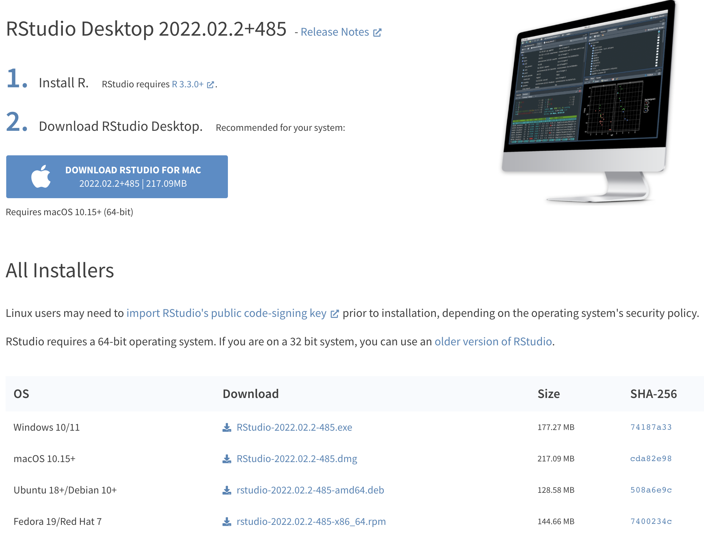
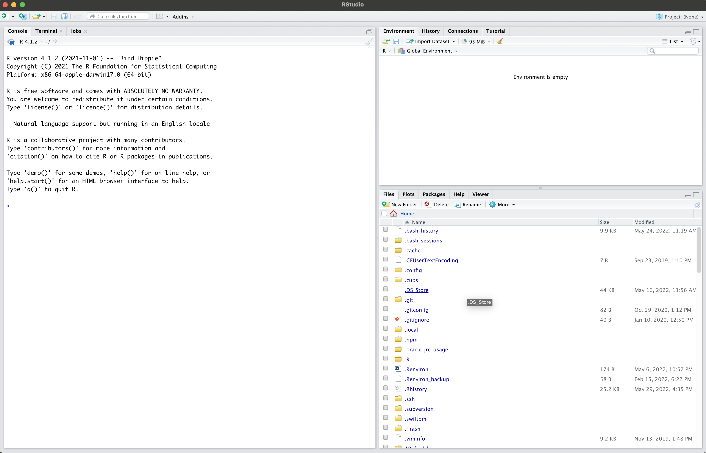
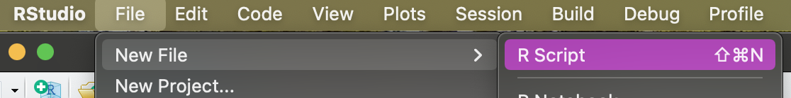
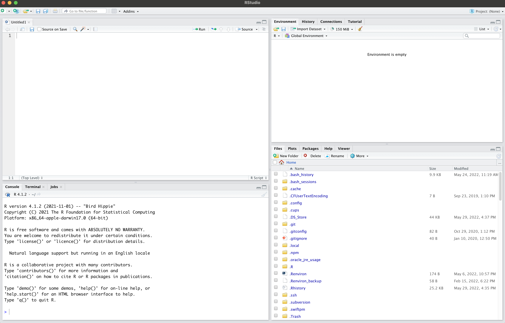
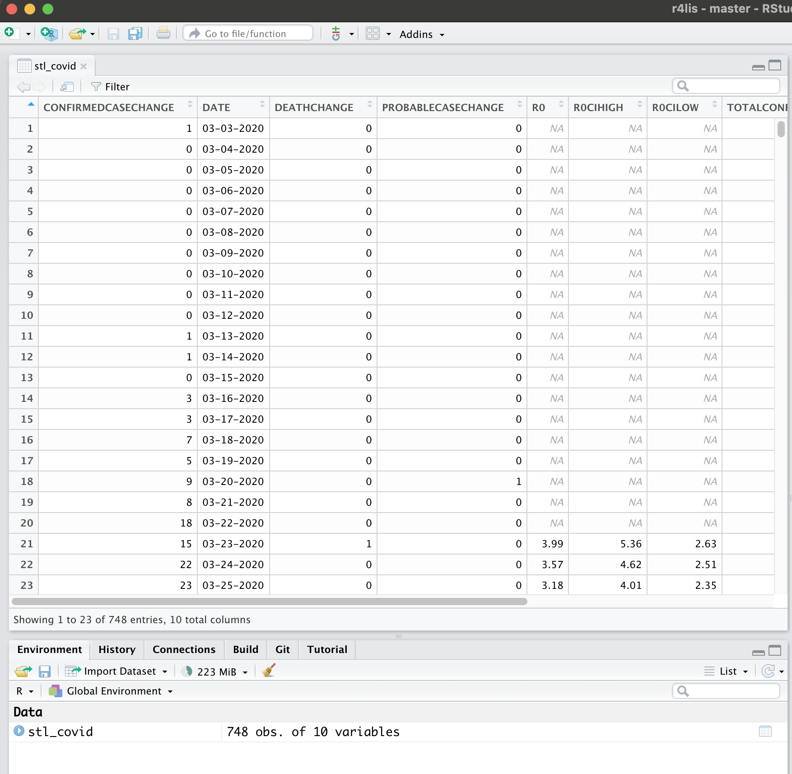

# Using RStudio's IDE {#rstudio}

## Learning Objective: use the RStudio IDE (Integrated Development Environment) for importing data. {#rstudio-los}
1.  Use your computer knowledge to install RStudio.
2.  Describe the function of each pane in the IDE.
3.  Modify IDE settings to their liking.
4.  Use the IDE to import a tabular data file. 

## Terms You'll Learn {#rstudio-terms}
* integrated development environment (IDE)
* package
* tidyverse
* session
* working directory

## Scenario {#rstudio-scenario}
You want to use R to do data science and publish a data-based report to support your outreach efforts, but you don't know how to code in R or get started.

## Introduction {#rstudio-intro}
This chapter aims to get you up and running with programming in R using the RStudio **Integrated Development Environment**, or IDE, which is generally referred to as 'RStudio.'  An IDE is a computer program that makes it easier to code; while you can use your computer's command line^[the program that enables you to type commands that your computer will follow to complete a task, such as Terminal on MacOS] or UNIX shell^[https://librarycarpentry.org/lc-shell/01-intro-shell/index.html] interface to code, the graphical user interface of an IDE makes it a lot more accessible.  The distinction between coding in the command line or using an IDE is a lot like the difference between finding stored files in the command line or or using Finder/File Explorer on your work or personal computer.  While there are some scenarios where using the command line makes the most sense, for the day-to-day, most computer users use the Finder/File Explorer to more easily navigate through their files and data.  IDEs are very common in computer programming, and many different applications exist.  We're using RStudio because it was designed specifically for R, though you can use it to program in Python and other languages.  It is free and open-source, and using it to program in R is a widely-used way to wrangle and interpret data.  We will also cover the basics of R as a programming language, and a widely-used core of packages called the Tidyverse and then install RStudio to get started with R.

## What is R? {#what-is-r}
Version 1.0 of the R programming language was released publicly in 2000^[https://blog.revolutionanalytics.com/2020/07/the-history-of-r-updated-for-2020.html], five years after initial distribution as open-source software.  The intellectual genealogy of R comes from the S statistical programming language, created at Bell Labs in the 1970s^[https://youtu.be/jk9S3RTAl38].  As a programming language, R was designed for statisticians to analyze data interactively.  R's statistical and academic origins stand in contrast to other programming languages used for data science.

R is an object-based programming language, where code and outputs are stored as objects to be acted upon later.  Algebra might store a single value or mathematical expression in a variable; R can hold single or multiple variables, or values, in each object.  Where algebra uses an equal sign to denote what a variable is, such as `x = 5`, R uses `<-` in the same way.  You can read the left-pointing arrow as the word "is."  We can use the `print()` function to display the value of an object when we put the object we want to see inside of the parentheses. 
```{r objects}
x <- 5
y <- x + 2

print(y)
```
R lets us work with data interactively through the use of code. When we write code in R, we are usually creating and saving data objects of various classes according to our needs. We can then conduct operations and/or analyses on these data objects in our R session(s). 

Common classes (types) for these objects include numeric, character (text) and logical (true/false). Objects of a single class are often collected and stored together as vectors. Vectors can in turn be grouped together to make larger data objects you might already be familiar with, including matrices, arrays, or data frames. In this book we focus on data frames.

The data frame structure is central to data analysis because it requires each element of the data frame to have the same length, just like rows in a table.  Another way to say this is that each column must be the same length; each column in the data frame must have the same number of rows.  This consistent table-like structure is vital for many data science functions.  Readers who move on to further data science tasks beyond this book will need to understand data class and structures.  Coding errors in R are often traced back to problems with incompatible data structures or inconsistent application of classes.

Please note that any code preceded by a `#` functions as a comment because R ignores anything following that character.  We can combine multiple values into one object using `c()` to determine an object's class using `class()`.
```{r classes}
# numeric vector
numbers <- c(8, 6, 7, 5, 3, 0, 9) 

class(numbers)
```

```{r}
#logical vector
values <- c(TRUE, TRUE, TRUE, FALSE, FALSE, FALSE, TRUE)

class(values)
```

Designed explicitly to work with data,  R works with many object types. Like many other programming languages, when data scientists find a need for specific applications and groups of related functions, they can create and bundle them into what R calls "packages".  A **package** is a group of associated functions equivalent to what in other languages might be called a "library." 

The complete list of the thousands and thousands of contributed R packages is on the Comprehensive R Archive Network, or CRAN (https://cran.r-project.org/).  These run the gamut from technical to purely fun.  Some packages focus on a particular skill (web scraping) or a specific dataset (the Project Gutenberg books).  You'll become familiar with a dozen or so packages throughout this book.  

## Introducing the Tidyverse {#tidyverse}
One of the most helpful R packages to become familiar with is the _tidyverse_ package, which is a collection of packages^[https://www.tidyverse.org/packages/] usually referred to as the Tidyverse.  Each of these, listed below, focuses on a different aspect of cleaning or tidying data before it's used or analyzed further.  While it is possible to use "base R," meaning the functions that come loaded with R when installing it, many R users prefer to use the Tidyverse because they make common tasks in R easier.  The Tidyverse packages all work together, and Posit, PBC staff maintain them.

The "core" Tidyverse packages include:
  * ggplot2, for data visualization
  * dplyr, for data manipulation
  * tidyr, for data tidying
  * readr, for importing data from CSV files
  * purrr, for functional programming (such as repetitive functions)
  * tibble, for tibbles, a more straightforward way to create data frames
  * stringr, for manipulating strings^[https://en.wikipedia.org/wiki/String_(computer_science)]
  * forecast for factors (a data structure not used in this book)

There are several other additional packages in the Tidyverse, and we will use several of them in this book:
  * httr, for web APIs
  * jsonlite, for JSON files
  * readxl, for .xls and .xlsx files. (not used in this book, but useful for those who use Microsoft Excel frequently)
  * rvest, for web scraping.
  * xml2, for working with XML formats

This book will cover the purpose and functions of these packages as they are needed.

## Getting Started with the RStudio IDE {#ide-start}
There are many ways to interface with R on your computer, and you can chose the interface that makes the most sense for you. Millions of R users use the graphical user interface provided by RStudio:

>The RStudio IDE is a set of integrated tools designed to help you be more productive with R and Python.  It includes a console, syntax-highlighting editor that supports direct code execution, and a variety of robust tools for plotting, viewing history, debugging, and managing your workspace^[https://www.rstudio.com/products/rstudio/download/].

RStudio is also open-source software, which means that the code used to create it is freely available to download, use, and modify.  In contrast, other statistical analysis software programs have inaccessible code and require paid subscriptions.  Additionally, Posit, PBC supports the continued development of RStudio by dedicating a portion of its engineering team to work only on open-source software projects.

### Install R
The RStudio IDE does not come with R; instead, download the latest version of R for your operating system from CRAN^[https://cran.r-project.org/].  Following the download and installation instructions for your operating system to install R.

### Install the RStudio IDE
We will use the open-source desktop version of the IDE, which is available as a free download from Posit's website^[https://www.rstudio.com/products/rstudio/download/#download].  On the download page, you should select the correct version of the IDE that matches your operating system (OS).  

After selecting the download button, follow the prompts on your computer to install RStudio.

### Navigating RStudio {#navigate-ide}
The RStudio IDE brings together all the tools you need to do data science: an editor to write code and text, a console to execute code, access to your computer's terminal, a file explorer, a viewer pane for graphs and visualizations, as well as a version control pane, for those who use Git or Github (more information in the appendix).  While it can accommodate many programming languages, the focus of this book will be using RStudio to code in R.  Within the ecosystem of R tools, it includes common code libraries and other tools, like spellcheck, which make the work of data science much more manageable. 


RStudio has numerous features, but this book covers only some of those.  We'll go over those that are necessary for the tasks at hand.  The left-hand pane is called the console, where we can type code directly, or else the IDE will run code within particular files automatically so we can see a log of our code as it executes.  Additional tabs are in that pane for the terminal (more information in the appendix).  On the top right is the environment pane, where the R objects you create and use in your session are stored.  The bottom right is the files pane, where you can navigate through your computer's file directory.  Other useful tabs in that pane are Help and Viewer, which shows any graphs or plots you create.

RStudio uses the concept of project files, which group together all the code and dataset files for one project.  Every new data science project should start with a new R project in the RStudio IDE.  From the **File** menu, select **New Project** and follow the prompts to create a new project.  Each project must have a name, which will create a folder of the same name and save all your code and other files within that folder.  Naming projects separately keep project files organized and more easily navigable from a file directory.  When you open a project at the start of your work session, the IDE will use the file directory for that project as that session's working directory.  Any files created will be automatically saved to that same directory or folder, helpful in keeping files organized. 

Once you create a file or open one, the console moves to the left bottom, and an editor pane opens in the upper left.  To store some R code as a file to access or re-run later, create a new R Script file by going to File > New File > R Script.


With four panes, the IDE screen looks like this:

  
## Packages needed for this book {#pkgs-download}
As you progress in your data science journey, you will install more and more R packages.  As with any new project you start, begin by installing all the packages you will need to use.  Please see the appendix for instructions on installing additional software that these packages depend on to function properly (commonly called 'dependencies').  You might see prompts in the console during this process.  If you're asked to install other packages, say 'yes.'  If you're asked if you want to compile binaries from source, say 'no.'

```{r packages, eval=FALSE}
# install the packages needed by this book; you may need to install dependencies before proceeding or if you encounter an error message

# Windows users will need to install _Rtools42_ before they can install any other packages; please see the appendix for more information.

lapply(c('xfun', 'tidyverse', 'gapminder', 'tidytext', 'jsonlite', 'units', 'rgdal', 'terra', 'sf', 'tmap', 'tidycensus', 'readr', 'textdata', 'tidymodels', 'flexdashboard', 'DT', 'shiny', 'Rcpp', 'raster'), function(pkg) {
if (system.file(package = pkg) == '') install.packages(pkg, repos="https://cloud.r-project.org")
})

# installing _rgdal_ can sometimes result in error codes. Please see the appendix for troubleshooting tips.
```
At the start of all subsequent chapters, you'll notice a code chunk that loads each package into your current session using the `library()` function.  Installing a package happens only once, but loading a package must occur each time you open RStudio or start a new R session.

## Viewing tabular data in RStudio {#ide-viewing}
Let's read some data into R and get more comfortable with RStudio while exploring the data.  We'll use COVID stats for the city of St. Louis that are available at: https://www.stlouis-mo.gov/covid-19/data/#totalsByDate.  Scroll down to Totals By Specimen Collection Date and click View Data, then save the csv file. 

After the file is saved, we can use the Tidyverse package _readr_ and its `read.csv()` function to read the file into R and make it available for us to use.  First, we need to load the Tidyverse packages we already installed with the `library()` function.
```{r read-stl}
#load _readr_ as part of the _tidyverse_ package
library(tidyverse) 

#create an object to store the csv data we read in
stl_covid <- read.csv("City-of-St-Louis-COVID-19-Case-Data.csv")
```

All output needs to be an object, so we created a `stl_covid` object that contains the csv file we just downloaded.  Most COVID datasets are very large, so while we could click on this object in the Environment pane and open it to view the entire file, we could use a few R functions to get a sense of what this dataset looks like. 

If we want to see the entire file, we can use the `view()` command to open up a spreadsheet view in our editor pane.  The file is very large, as expected.
```{r view-covid, eval=FALSE}
view(stl_covid)
```

We can also use some built-in base R functions to see snippets of the `stl_covid` dataset.  To see the first ten lines, we can use `head()` and `tail()` to see the last ten lines.  An additional function is `summary()`, which will display summary statistics for each column in the data frame.
```{r stl-summary}
head(stl_covid)
```

```{r}
tail(stl_covid)
```

```{r}
summary(stl_covid)
```

While this dataset originated as a CSV file, there are specific R packages for reading in Microsoft Excel (_readxl_) and Google Sheets (_googlesheets4_).  This book works only with CSV files, but know that if you often work with those proprietary formats, other packages exist to help you with those if you don't want to convert them to CSV files first.

## Summary {#rstudio-summary}
This chapter took you from no experience coding in R to interacting with data in the RStudio IDE using R functions.  R is an object-oriented programming language used within RStudio's graphical user interface alongside several popular code packages, such as the Tidyverse.  New users must install R and RStudio before learning the various features the IDE offers for data scientists.  There are several ways to view data in RStudio, whether viewing the entire dataset file or using R functions to see snippets of the dataset within the console.

## Further Practice {#rstudio-study}
  * Read in a csv file of your own and run the same summary functions: `head()`, `tail()`, `summary()`
  * Install _janeaustenR_ for use in chapter 6

## Additional Resources {#rstudio-resources}
  * _Hands-on programming with R_, Garrett & Hadley
  * RStudio IDE, Base R, & data import (_readr_) cheatsheets: https://www.rstudio.com/resources/cheatsheets/
  * "Getting Started with R and RStudio": https://moderndive.netlify.com/1-getting-started.html
  * An Introduction to R: https://cran.r-project.org/doc/manuals/R-intro.html
