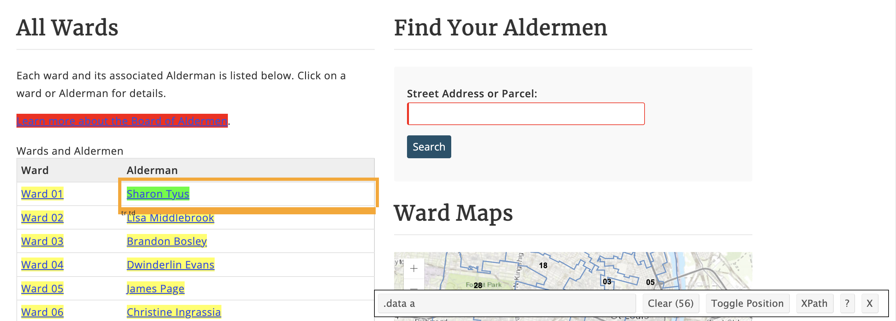

# Webscraping with _rvest_ {#rvest}

## Learning Objectives{#rvest-los}
1. Explain how to determine which html tags will provide needed data
3. Use the _rvest_ package to scrape webpage content into the RStudio IDE
4. Create a dataset from the scraped content
5. Use _dplyr_ to normalize the dataset
6. Create a csv file from the scraped content
 
## Terms You'll Learn {#rvest-terms}
* web scraping
* subset

## Scenario {#rvest-scenario}

You want to advertise your report and outreach program to garner support from government leaders in St. Louis.  Reaching out to the aldermen's offices within the city seems most likely to support this goal.  A website lists the aldermen, but you have to click on each name to get to the webpage that lists each alderman's email address.  Rather than clicking on 29 links and copy/pasting each email address, name & ward number, you can use _rvest_ to scrape this information from the city's website and put it into a table you can update and reuse through the life of this program.

## Packages & Datasets Needed {#rvest-pkgs}

First, we need to load the packages we need into our current environment to access the functions.  We are using _rvest_ and _purrr_ in this chapter while revisiting _dplyr_.
```{r rvest-pkgs1, echo=FALSE}
library(tidyverse)
library(rvest)
library(xml2)
```

## Introduction {#rvest-intro}

So much valuable information and data are available on the internet, but it's hard to use directly on a webpage.  Getting information from a website in an automated manner and into a format that's usable and compatible with other applications is made much easier with the advent of web scraping.  **Web scraping**^[https://en.wikipedia.org/wiki/Web_scraping] uses code to load a webpage and extract data contained on the page.  Taking a list of names and addresses and putting it into a table that you could turn into a set of mailing labels without repetitive copy/paste keystrokes is one way that web scraping can automate an onerous task.  Contact information for a mailing list is a straightforward use case for web scraping, but the options are as numerous as web pages on the internet.

Web scraping works by selecting HTML or CSS fields on a webpage and using code to extract the values of those fields.  Often, a web page will use a `/table` HTML tag to indicate tabular data, but just as often, websites use CSS to make content appear in a table without utilizing the semantic HTML option of the table tag; it looks great, but it can be hard to scrape.  As a user, it's up to you to figure out what tags to scrape to get the data you need.  Determining which tags to scrape can be challenging depending on the website's code, but it also allows you to choose only those elements that matter.  The proper tags with a bit of code can return reams of data in seconds that could take hours to extract manually.  The ability to pull content from websites significantly broadens what users can think of as data.

## Identifying  & Scraping Website Components {#rvest-components}
To get in contact with each alderman, we need their email.  But to keep our records straight, we also want to know the alderman's name and which ward they represent.  Thus, the metadata fields we need are ward number, alderman name, and alderman email address.

The website listing St. Louis aldermen is https://www.stlouis-mo.gov/government/departments/aldermen/Wards-1-28.cfm.  It lists the 28 city wards and the alderman's name representing that ward.


The Wards & Aldermen page provides us with the ward numbers and their representative alderman, but it does not list the alderman's email address.  Both the ward number and the alderman name are hyperlinks to the same alderman's webpage.  


The individual alderman websites do provide the alderman's email address, physical address, and phone number.  From these pages, we can anticipate two stages to our web scraping.  First, we'll need to scrape the list of wards and aldermen.  Then we'll need to scrape each alderman's webpage for their email address.

Before we get started coding, we need to determine the CSS tags, or selectors, that we need to scrape.  To do that, we'll utilize a tool called Selector Gadget^[https://selectorgadget.com/], which is available as a Chrome^[https://www.google.com/chrome/] browser extension, to expose and identify CSS tags on the data we need.   The _rvest_ website^[https://rvest.tidyverse.org] recommends SelectorGadget.

After installing Chrome and SelectorGadget, we navigate to https://www.stlouis-mo.gov/government/departments/aldermen/Wards-1-28.cfm and click SelectorGadget from the Chrome extensions menu.  Once SelectorGadget is engaged, we click on the content we want to scrape (any ward number or alderman name).  SelectorGadget highlights the content and provides the CSS selector to scrape in the dialog box at the bottom of the browser.  If SelectorGadget highlights more fields than what we want, we'll click on the extraneous elements to deselect them.  Once finished, SelectorGadget will display the selector we need to use with _rvest_.  We'll need to repeat this for each page and element we need.



To scrape the aldermen's names and ward numbers, we need the CSS selector `.data a`.

## Web scraping part 1: wards & aldermen {#scraping1}

1. Scrape each alderman's name and ward number 

First, we will use the `read_html()` function to read the webpage we want to scrape. Our second step is to save that scraped webpage in an HTML file so that we can access it later.
```{r scrape}
scrape <- read_html(
  "https://www.stlouis-mo.gov/government/departments/aldermen/Wards-1-28.cfm"
)

write_html(scrape, "scrape.html")
```

After we read the scraped HTML file back in, then we'll use `html_nodes()` to indicate which selector to scrape (`.data a`).  The `html_text()` function turns the scraped content into readable text format.  We'll `unlist()` the data and put it into an R table format with `tibble()`.  In chapter 2 we talked about different data structures in R; `base::unlist()` is an R function that converts a list into a vector.  This standardizes the data, ensuring that all elements have the same data class so that they can be moved into a table with the `tibble()` function. Finally, we can check our dataset to make sure we scraped what we wanted:

```{r ward}
wards <- read_html("scrape.html") %>%
  html_nodes(".data a") %>%
  html_text() %>%
  unlist() %>%
  tibble()

wards
```

2. Tidy aldermen names and ward numbers 

We can see from the output above that the `wards` object doesn't have the ward number and alderman name on a single line, as we need it to be.  The problem is that because the ward number and the alderman's name use the same CSS selector, R put all columns and rows into the same character vector without unique separators between lines.  To fix this problem, we need to create a new tibble where column 1 is all the odd rows of wards and column 2 is all the even rows, so we have a tidy dataset^[https://vita.had.co.nz/papers/tidy-data.pdf].

We'll need to use two new operators to select the even and odd rows separately: `%%` and `==`.  The double equal signs mean that two values must be exactly equal to each other, and the double percentage signs return the remainder (as in division).  We're creating objects called even when rows are divisible by 2 (the remainder is zero) and odd when a row has a remainder of 1 when divided by 2.  We will do this in two steps to create an object for our odd rows and another for even rows:

```{r odd-rows}
ward_num <- wards %>%
  filter(row_number() %% 2 == 1) %>% # odd rows
  tibble() %>%
  rename(Ward = names(.))

# the '.' can be read as "the current object,
# created in the previous line"
```

Additionally, we'll rename the columns with a blank header using the dplyr `rename()` function, because columns without header rows are hard to work with and hard to remember what's inside that column.  When using `rename()` we need to pass the function two pieces of information: the data and the new column name.  However, since we are using the pipe to combine functions, the data isn't an object we can reference so we need a workaround.  The argument we'll pass to `rename()` here is the new name and we'll say that it is equal to the name that is currently called `.` using the `base::names()` function, which R recognizes applies to the name of a list or vector.  

While this explanation is a little long, this code is more efficient than creating an object with an blank column name and then adding a new object that is the same data, but with a new column name.  In essence, this code allows us to do all of our actions in one object rather than two.
```{r even-rename}
alderman <- wards %>%
  filter(row_number() %% 2 == 0) %>% # even rows
  tibble() %>%
  rename(Alderman = names(.)) 
# rename the Alderman column, which has a blank column name
```

Finally, the column bind function, `base::cbind()`, will let us bind the objects for alderman names and ward numbers together into one table, where each vector becomes a column in the table:
```{r ewar-cbind}
wards_alderman <- cbind(ward_num, alderman)
# combine the two columns together into one tibble

head(wards_alderman)
```
We now have a tidy dataset where each observation includes the ward number and that ward's alderman.

## Web scraping part 2: email addresses on individual pages {#scraping2}

1. Scrape the Aldermans' contact page URLs

The first page we scraped lacks the email address for each alderman, but we did scrape the name and ward number.  Each alderman's web page contains their contact information, including their email address.  However, we need to scrape the links to each alderman's page before scraping the email addresses.  With the second round of scraping, we will pull the URLs (`href`) for the aldermen's pages and each alderman's email address from that page.   

We're still interested in the same CSS selector, `.data a`, but this time we do not want the value for that selector.  Using `html_attr()`, we indicate that we want the link, or `href`, for those values.  The href doesn't include the entire URL to the aldermen's sites but only the relative file path: `/government/departments/aldermen/ward-1`. Each file path is relative to the `base_url` in that the relative file path is text that would be appended to the `base_url`.  Thus, our code will need to scrape the href but then combine that with the base URL, `https://www.stlouis-mo.gov/`, to find the full URL we need to scrape in the subsequent step.  The R function `file.path()` is a faster version of paste, and we will use it to paste the two URL components together.  In coding, the relative file path is usually represented by `.`, as we see in the `file.path(base_url, .)`.  When run repeatedly, the relative file path will change, but each will be combined with the `base_url`:

```{r website}
base_url <- "https://www.stlouis-mo.gov"

href <- read_html("scrape.html") %>%
  html_nodes(".data a") %>%
  html_attr("href") %>%
  file.path(base_url, .) %>%
  str_replace_all("gov//", "gov/") %>%
  tibble()
```
There's an additional step to mention here: the base URL ends in a forward slash, and the relative file path starts with a forward slash.  Combining these two portions will get a double forward slash that will invalidate the complete URL.  We'll utilize a function from the _stringr_ package (part of _tidyverse_) that lets us modify a string in many ways.  We want to use `str_replace_all()` to remove the double forward slash.  However, we must specify that we only want to replace the double forward slash after `gov`.  Otherwise, our code will replace the double forward slash after `https:`. Only then can we store the data in a tibble and check to see that the data looks clean.

```{r head-href}
head(href)
```

2. Clean up the website addresses 

Similar to the duplication problem we had at the start of the chapter, we're getting duplicate lines for each URL because both the ward number and the alderman's name link to the same contact page on the original web page.  Both also use the same CSS tag, so we can't separate the two and only pull one of the links.  We need to pull out only one copy of each link using the previous filtering by even rows.  Additionally, as with so many of our columns, we need to rename those with empty header rows (which include only a period):
```{r clean-urls}
urls <- href %>%
  filter(row_number() %% 2 == 0)

websites <- rename(urls, website = .)

websites
```

3. Combine the ward numbers, alderman names, and website URLs

We've come far enough that it makes sense to combine the objects we have into a single table.  Again, we'll use the column bind function to combine the objects we have so far into one table:
```{r vector-bind}
all_urls <- cbind(wards_alderman, websites)
# one table of ward, aldermen, and links to their webpages
```

### Automating tedious scraping
As is often the case with data 'in the wild,' the information we need about the city aldermen isn't neatly shown on one webpage.  We scraped the alderman names, ward numbers, and personal website URLs, but clicking on 28 websites and copying and pasting email addresses sounds tedious and prone to error.  Plus, aldermen join and leave this list, making our data valid for only a short while.

Thankfully, just as we can automate data collection by scraping it off a website, the Tidyverse presents a package and function combination to automate tedious web scraping tasks.  In this case, we'll use the Tidyverse package _purrr_ to iterate over the list of website URLs.  The `map()` function from _purrr_ lets us perform the same commands we did previously, by iteratively on each alderman's website.  For every website listed in `vector`, we will apply `read_html()` to read in those websites.  Then we will scrape the email HTML field from each page using `html_node()`.

However, there is one problem with our data as it currently stands.  R has several object classes and `purrr::map()` only works on lists or atomic vectors.  Other object classes include matrices, arrays, factors, and data frames.  Having an object of the wrong type for the function you want to execute is a common cause of error messages when coding in R.  To find out the object class you have, you can use `base::class()`:
```{r urls-class}
class(all_urls)
```
Our object is a data frame, and while that is great for creating tables, it will not work for `map()`.  We only need to change the column we need to use in our scraping task, so we will select the 3rd column, `websites`, from the object `all_urls`.  To do that we will **subset**, or take one group of data within a larger group, the 3rd column of `all_urls`.  The double square brackets on either side of the number three indicate what is being subsetted.  This is a useful operation that we'll use several times in this book when we need to break out one part of our larger dataset.  We'll create a new object, `vector_urls`, where we change the data structure of the `websites` column from a data frame to a vector using `as.vector()` so that the scraping function we need to do next will work.
```{r vector}
vector_urls <- as.vector(all_urls[[3]])
```

1. Scrape aldermen email addresses 

Before scraping email addresses for each alderman, we must determine which CSS selector we need to scrape.  Using SelectorGadget as we did before, we see that each alderman's email address uses the `strong+ a` selector.


We are now ready to automate scraping each alderman's website for their email address.  First, we will use `map()` to read in the HTML for each element of our vector of alderman website URLs.  Then we will use `map()` again to scrape the CSS selector `strong+ a` from the HTML we read for each site.  
```{r emails-scrape, cache=TRUE}
scrape_sites <- map(vector_urls, read_html)
# scrape each URL in the vector

scrape_email <- map(scrape_sites, html_node, "strong+ a")
# pull out the email address on each of those pages
```

2. Convert email addresses into readable format

We will use `map()` again to turn each scraped field into a text format using `html_text()` and then put the clean text into a table.
```{r email-list, eval=FALSE}
email_list <- map(scrape_email, html_text) %>%
  unlist() %>%
  tibble()
```

## Create reusable data file {#csv-file}
To reuse the scraped data in subsequent chapters, we need to make a new table with clear column headers that combine all four tables into one: ward number, alderman name, and alderman website from all, and alderman email.

1. Rename column headers

```{r rvest-columns, eval=FALSE}
emails <- rename(email_list, Email = .)
```

2. Create a single table with all necessary elements 
```{r aldermen-complete, eval=FALSE}
complete <- cbind(all_urls, emails)
head(complete)
```
Now have the full dataset we need to contact all the aldermen!

3. Write to CSV 

Once we've created a complete, tidy table of all the wards, the aldermen, and their email addresses, we want to save that as a CSV file for reuse or sharing.
```{r contacts, eval=FALSE}
write_csv(complete, "data/aldermen-contact.csv")
```
The `write_csv` function takes our object, 'complete,' and turns it into a CSV file we could read back into R or view in a spreadsheet application like Google Sheets or Microsoft Excel.

## Summary {#rvest-summary}
We created a CSV file of aldermen's contact information by identifying which webpages had the information we needed, what specific HTML tags that data was stored in, scraping those particular tags, and tidying the scraped data.  The St. Louis aldermen webpages are a real-life example of dispersed data on the web that can't be copied and pasted into a spreadsheet.  Instead, we used code to speed up and automate data acquisition, saving the code and the output.  When new aldermen are elected, we need only re-run the code to update the contact list, which saves us a lot of time and energy.

## Further Practice {#rvest-study}
  * scrape each alderman's phone number and add it to the `complete` object as a new column
  * scrape a webpage from your employer that lists employees
  * scrape the contact information for your state senators

## Additional Resources {#rvest-resources}
  * Apply functions with _purrr_ cheatsheet: https://www.rstudio.com/resources/cheatsheets/
  * _rvest_ package site: https://rvest.tidyverse.org/
  * _Webscraping with R_ by Steve Pittard: https://steviep42.github.io/webscraping/book/
