# Mapping with _tmap_ {#tmap}

## Learning Objectives {#tmap-los}

1. Define geographic concepts relevant to cartography such as geographic coordinate system, projected coordinate system, datum, and spheroid.
2. Describe vector and raster data.
3. Perform loading spatial data and tabular into RStudio using relevant functions.
4. Apply a data transformation of spatial data into an appropriate projection.
5. Use appropriate functions in the `tmap` package to display spatial data.

## Terms You'll Learn {#tmap-terms}
  * Geographic Information Systems 
  * Spatial data
  * Vector data
  * Raster data
  * Projection
  * Coordinate Reference System
  * Latitude
  * Longitude
  * Shapefile
  * Census tract

## Scenario {#tmap-context}
After creating plots of occupations with the lowest unemployment, you decide to create maps showing the total unemployment in the city. Being able to see the areas with the lowest and highest unemployment will be helpful in targeting outreach in areas with the highest unemployment. You want these maps to be interactive so users can click on an area and get information about that area in the city. However, you are not sure how to visualize this in a map. Questions that come to mind are:

- Where can I get spatial data to make a map?
- What kind of spatial data do I need to make a map?
- What relevant R packages can be used to create these maps?

## Packages & Datasets Needed {#tmap-pkgs}
```{r load-tmp-pkgs, echo=FALSE}
library(tidyverse)
library(tidycensus)
library(tmap)
library(sf)
library(raster)
```

## An overview of spatial data {#spatial-overview}

To make a map, you need to use **spatial data**. So what makes spatial data special? Spatial data has geographic attributes which allow it to be mapped.

### Vector and raster data

There are two types of spatial data: vector data and raster data. **Vector data** is composed of lines, polygons, and points. Lines can be used to represent features such as roads, county boundaries for polygons, and the location of bus and metro train stops for points data. 

```{r lines, echo = FALSE, eval=FALSE}
stl_streets <- st_read("streets/TgrGeoCd.shp")
tmap_mode("view")
tm_shape(stl_streets) +
  tm_lines()
```
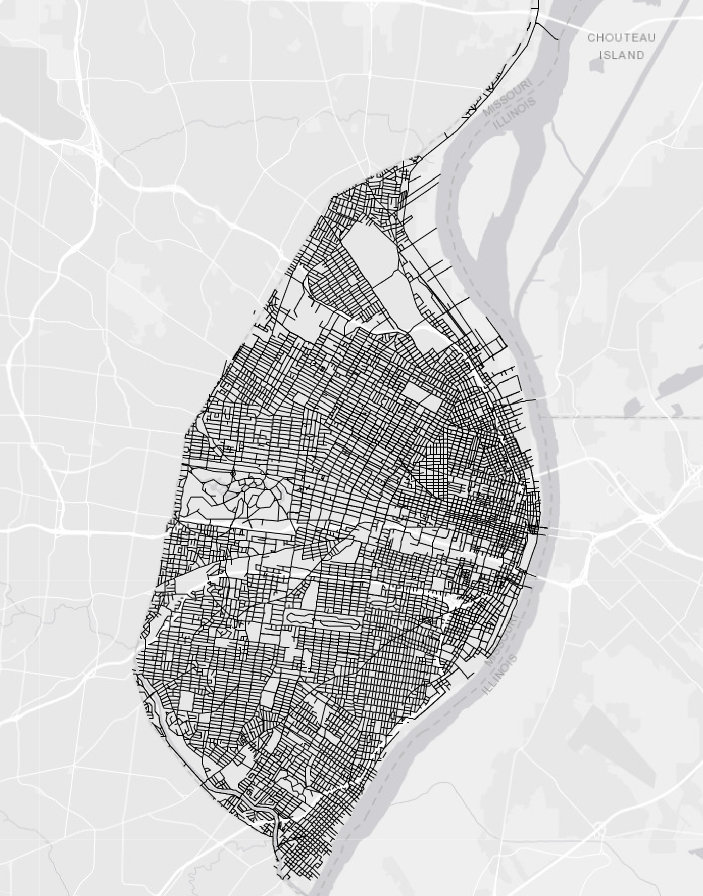

```{r points, echo = FALSE, eval=FALSE}
stl_stops <- st_read(
  "Metro_St._Louis_MetroBus_Stops_By_Line/Metro_St._Louis_MetroBus_
    Stops_By_Line.shp"
)
tmap_mode("view")
tm_shape(stl_stops) +
  tm_dots()
```

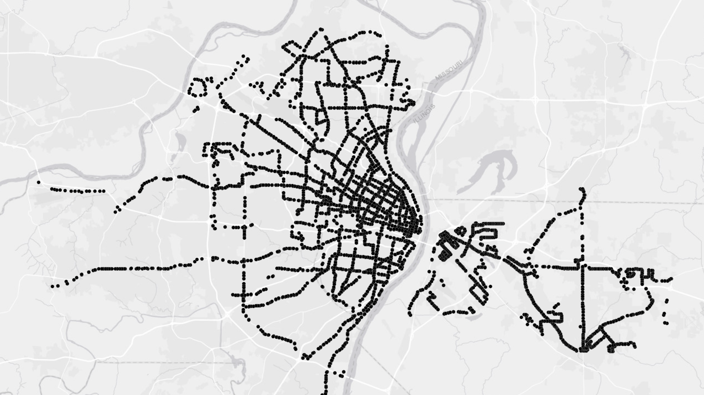
footnote^[https://data-metrostl.opendata.arcgis.com/datasets/current-metrobus-metrolink-stops-and-routes]

```{r polygons, echo = FALSE, eval=FALSE}
stl_parks <- st_read("parks/parks.shp")
tmap_mode("view")
tm_shape(stl_parks) +
  tm_polygons(col = "green")
```

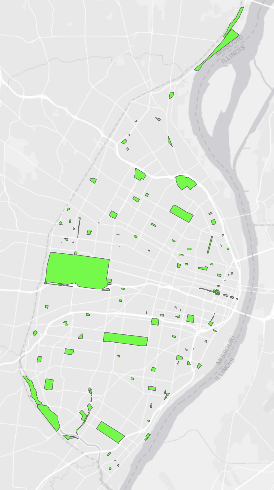
footnote^[https://www.stlouis-mo.gov/data/datasets/dataset.cfm?id=46]

**Raster data** is image data, where each pixel represents a value. A popular raster dataset is the National Aerial Imagery Program^[https://www.usgs.gov/centers/eros/science/usgs-eros-archive-aerial-photography-national-agriculture-imagery-program-naip] which is a program managed by the USDA that collects satellite imagery during the growing seasons. 

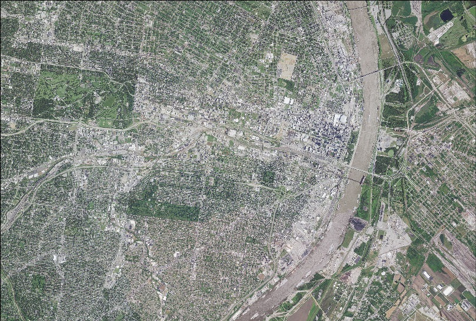

### Coordinate Reference Systems

Some spatial data are not ready to be mapped. For spatial data to be mapped, they need something called a coordinate reference system.  A coordinate reference system shows how spatial elements relates to the Earth's surface [@lovelace2019]. There are two types of coordinate reference systems: a projected coordinate system and a geographic coordinate system.  A **geographic coordinate system** is based on latitude (lines of North-South orientation in relation to the equator) and longitude (lines of East-West orientation in relation to the Prime Meridian). A **projected coordinate system** (also known as just a projection) is a mathematical model of a 3D globe that is flattened on a 2D surface.  There are a multitude of projections that are used for a variety of purposes. For example, the Mercator projection is good for navigational purposes, but not so good for visualizing the Earth on a 2D surface since it exaggerates size of  continents such as North America and minimizes the size of continents such as Africa. In the context of our scenario, it is best to use the State Plane Projection^[https://www.usgs.gov/faqs/what-state-plane-coordinate-system-can-gps-provide-coordinates-these-values] since this projection is highly accurate for the local level. 

### Is your data projected or not?

How do you know if your data is projected? One way is to simply look at a map. For example, an unprojected map of the US would have straight lines and the states would look distorted. For example, the northern part of the country would be mostly a straight line. A projected map of the US reflects the curvature of the earth and the northern border of the country would be curved.

Another way that you know that data isn't projected is that you will get errors trying to run specific spatial analyses. For example, if you wanted to calculate the nearest bus stop from the library and you are using unprojected data, you will get an error message. Since the data is not projected there is no spatial reference, which means that you cannot do any spatial calculations. 

In R, you can use the `st_crs()` function in the _sf_ package to determine whether your spatial data has a projection or not. Let's see if the US shapefile below has a projection:  

```{r unprojected-1} 
us <- st_read("us_state_clip/us.shp") %>%
  st_crs()
```
This shapefile does not have a projection. Let's see what another shapefile looks like.

```{r unprojected-2, echo = FALSE, eval=FALSE}
us <- st_read("us_state_clip/us.shp")
tmap_mode("plot")
tm_shape(us) +
  tm_polygons()
```
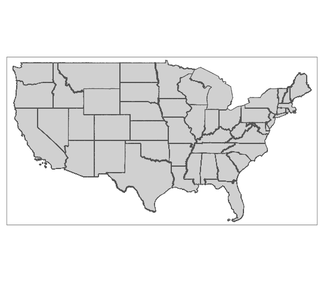

You can tell that this shapefile does not have a projection given the straight lines at the top and bottom of the country. On a spherical surface, the US would not look like this. This is where projections come into play.

To change the projection, we will have to use `st_transform()` and we will use the US National Atlas Equal Area projection^[https://epsg.io/2163].


```{r projected, eval=FALSE}
us_project <- us %>% st_transform(crs = 2163)
tmap_mode("plot")
tm_shape(us_project) +
  tm_polygons()
```
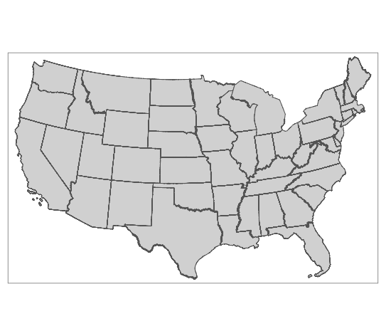

Once the data has been projected, you can see that the curvature of the Earth has been taken into consideration in projecting it on 2D surface. The top and bottom borders of the country are curved.

### How can I find an appropriate projection?
You can approach finding the appropriate projection for your data by establishing the purpose of using your spatial data. Are you using spatial data for analysis purposes or to display something? After you determine that, you should think about your area of interest. On what scale are you doing your mapping and analysis? In terms of trying to find the right projection for your area of interest, you can use the epsg.io^[http://epsg.io] website to determine your projection based on location. After that you can create a list of possible projections and narrowing it down based on your purpose and further research (see additional resources at the end of this chapter).

In the context of this project, we will be using the NAD 1983, State Plane Missouri East, FIPS 2401 feet. As mentioned before, the state plane projection is good in mapping local areas given the way the zones are derived.

In short, to map data you need:
1. A spatial dataset.
2. An appropriate projection for that spatial dataset.

This overview of spatial data is just to get you up and running. For more in-depth information about coordinate reference systems and other spatial data foundational concepts, please refer to the "Geographic Data in R"^[https://geocompr.robinlovelace.net/spatial-class.html#crs-intro] chapter in _Geocomputation in R_ by Robin Lovelace, Jakub Nowosad, and Jannes Muenchow [@lovelace2019].

## Loading in the data
The type of spatial data that we will be working with is called a **shapefile**. A shapefile is a vector data format that holds the spatial object, and the attribute information of that spatial object. It is actually made of up several files such as a database file, an xml file that holds the metadata, and a projection file (if the shapefile already has a projection). We are going to load in the WARDS_2010 shapefile which was retrieved from the St. Louis City open data portal^[https://www.stlouis-mo.gov/data/]. If you take a look at the WARDS_2010 shapefile, you will see that it is actually comprised of several files such as WARDS_2010.prj, which holds the projection, and WARDS_2010.dbf that holds the attribute information for each ward. 

We will need to use `st_read()` function from the _sf_ package to load the shapefile into RStudio. After that, we will use the `st_crs()` function to see if the shapefile has a coordinate system. We are also going to read the unemployment_tract shapefile that was created in the previous chapter.
```{r stl_data}
stl_wards <- st_read("nbrhds_wards/WARDS_2010.shp")
stl_tracts <- st_read(
  "unemployment_tract/unemployment_tract.shp"
) %>%
  rename("unemployment_rate" = "unmply_") %>%
  mutate(unemployment_rate = unemployment_rate * 100)
```

We can see that the shapefile has a coordinate system which is NAD 1983, State Plane Missouri East, FIPS 2401 feet. Next we will create a simple static map using the _tmap_ package. We will call the `stl_wards` shapefile within the `tm_shape()` function which is used to call a spatial object. Within that function we will designate miles as our units of measurement. The `stl_wards` shapefile is a polygon, so we need to also add the `tm_polygons()` function to draw the polygons.

```{r code-2, eval=FALSE}
tmap_mode("plot")
tm_shape(stl_wards, unit = "mi") +
  tm_polygons()
```

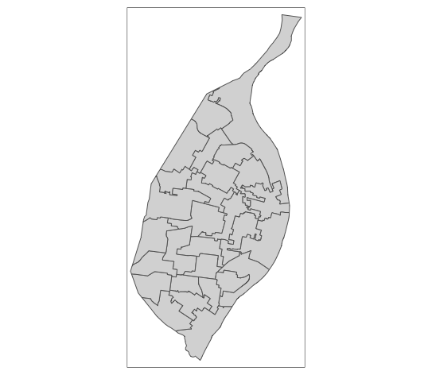

We can add cartographic elements to the map which includes a title, scale bar, and north arrow using the `tm_layout()`, `tm_scale_bar()`, and `tm_compass()` functions respectively. 

```{r code-3, eval=FALSE}
tmap_mode("plot")
tm_shape(stl_wards, unit = "mi") +
  tm_polygons() +
  tm_layout(title = "Wards in St. Louis City", title.size = .7) +
  tm_scale_bar(position = c("right", "bottom"), width = .3) +
  tm_compass(position = c("left", "top"))
```
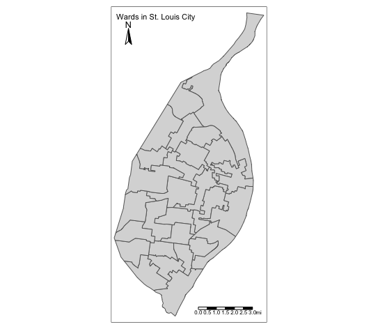

Let's make a static map of the Census tract map. A **census tract** is one of the smallest statistical units of a county and has about an average population of 4,000 (U.S. Census Bureau, 2022) First, let's check and see what the coordinate system of the Census tracts.
```{r code-4}
st_crs(stl_tracts)
```
The CRS is NAD 1983. Let's create a map showing the unemployment rate.

```{r code-5, eval=FALSE}
tmap_mode("plot")
tm_shape(stl_tracts) +
  tm_polygons("unemployment_rate")
```

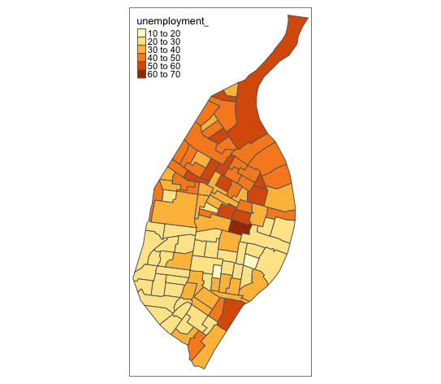

The legend title can be cleaned up, so let's change the name of the legend when adding the cartographic elements to the map. In addition,the legend items are overlapping the Census tracts, so we need to make the legend items smaller. We can do this by changing the legend position and the inner margins. A margin is the space around an element. In this case, the element would be the St. Louis Census tracts and the legend. The inner margins is the space inside the frame that is between the frame and the element.

```{r code-6, eval=FALSE}
tmap_mode("plot")
tm_shape(stl_tracts, unit = "mi") +
  tm_polygons(
    "unemployment_rate",
    title = "Unemployment rate"
  ) +
  tm_layout(
    title = "Percentage unemployed by Census tract",
    title.size = .7,
    legend.width = 1,
    legend.text.size = .4,
    legend.title.size = .5,
    legend.position = c("left", "top"),
    inner.margins = c(0.01, 0.01, .12, .25)
  ) +
  tm_scale_bar(position = c("right", "bottom"), width = .3) +
  tm_compass(position = c("right", "center"))
```
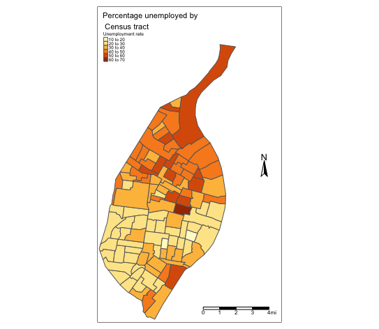

We can make our maps dynamic and interactive with the _leaflet_ package^[https://rstudio.github.io/leaflet/]. We can access that package within the `tmap` package itself, since `tmap` imports the `leaflet` package already. Let's create _leaflet_ maps of the wards and the Census tracts. We will do that by changing the `tmap_mode()` function to 'view.' Here is a map of the wards in view mode:

```{r code-7, eval=FALSE}
tmap_mode("view")
tm_shape(stl_wards, unit = "mi") +
  tm_polygons()
```

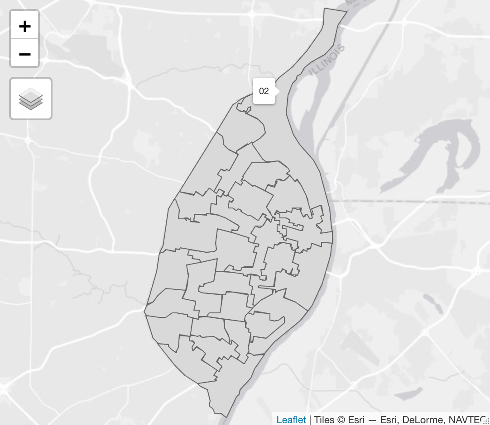

Let's create a _leaflet_ version of the map showing the unemployment rates by Census tract that we created earlier. We will use the `tm_fill()` function to add color ramp to the Census tracts to indicate the unemployment rate. With _leaflet_, you can click on the Census tracts and a pop up will appear. We can customize the pop-ups using the `popup.vars` option within `tm_fill`. The pop-up will show the unemployment rate and the name of the Census tract.

```{r code-8, eval=FALSE}
tmap_mode("view")
tm_shape(stl_tracts) +
  tm_fill("unemployment_rate",
    title = "Umemployment rate",
    popup.vars = c("% unemployed" = "unemployment_rate"),
    id = "NAME"
  )
```

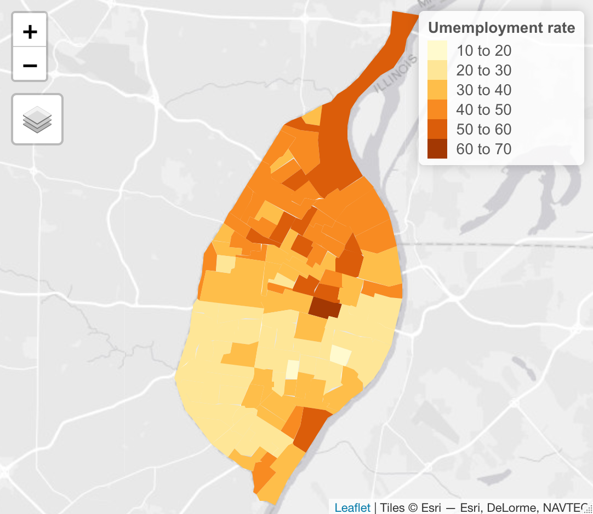

## Summary {#tmap-summary}
Spatial data is composed of vector and raster data. Vector data is composed of points, lines and polygons while raster data is image data in which each pixel represents a value. You can map vector data with the _tmap_ package. One of the kinds of vector data that you can map is called a shapefile, which is actually comprises several files. In this chapter, we mapped a static map of St. Louis wards and the unemployment rate in each ward. With _tmap_, you can also create dynamic web maps using the _leaflet_ package which you can call by itself or from within _tmap_. We also created a web map of the wards and the unemployment rate by ward.

## Further Practice {#tmap-study}
  * Modify the pop-ups to include the total population per census tract (ttl_ppE). You can name the pop-up label "population."

## Additional Resources {#tmap-resources}
  * U.S. Census Bureau (2022). Glossary. Retrieved from https://www.census.gov/programs-surveys/geography/about/glossary.html#par_textimage_13
  * _Geocomputation with R_: https://geocompr.robinlovelace.net/index.html
