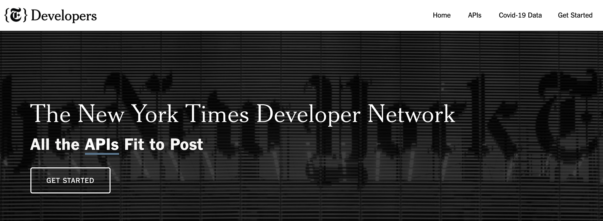

# Textual Analysis with _tidytext_ {#tidytext}

## Learning Objectives {#tidytext-los}
1. Describe a use case for text mining
2. Use the tidytext package to load a textual dataset into the IDE
3. Tokenize a textual dataset
4. Perform a sentiment analysis of the textual dataset
5. Identify the text’s most common words using tf-idf functions

## Terms You'll Learn {#text-terms}

  * text mining
  * sentiment analysis
  * JSON
  * for-loop
  * term frequency
  * inverse document frequency
  * tf-idf

## Scenario {#text-scenario}
Looking for a job is stressful! Being unemployed when you want to be employed is hard.  Is there any data to support that unemployment has negative connotations?  You'd like to add a section to your report to highlight the negative cultural connotations associated with unemployment, which job seekers feel, to further support your position that a library/community partnership is needed.  In this case, newspaper articles can function as cultural data to support your premise.  You'll use the _tidytext_ package to text mine article metadata from the _New York Times_ and add that analysis to your report.

## Packages & Datasets Needed {#text-pkgs}

```{r rvest-pkgs, message=FALSE, error=FALSE}
library(tidyverse)
library(jsonlite)
library(tidytext)
```

## Introduction {#text-intro}

When working with datasets containing numerical values, we can use statistical analysis and visualizations to describe our data.  Within librarianship, like in the humanities and social sciences, datasets are often composed of text.  **Text mining**^[https://en.wikipedia.org/wiki/Text_mining] provides insight into textual data by turning text, documents, or even books into a dataset.  We can describe, analyze, modify, and visualize a dataset of words just as we would numbers.

We might want to analyze many academic and social texts, from our library collections, or words used in social and cultural domains that affect library patrons and the communities we serve, including some that are just for fun.  Looking at a few R-specific packages for textual analysis tasks is one way to see the breadth of possibilities for text mining:

  * _twitteR_^[https://cran.r-project.org/package=twitteR]
  * _gutenbergR_^[https://cran.r-project.org/package=gutenbergr]
  * _janeaustenR_^[https://cran.r-project.org/package=janeaustenr]
  * _scotus_^[https://github.com/EmilHvitfeldt/scotus]
  * _pubmedR_^[https://cran.r-project.org/package=pubmedR]
  * _jstor_^[https://cran.r-project.org/package=jstor]
  * _nasadata_^[https://cran.r-project.org/package=nasadata]
  * _rfacebookstat_^[https://cran.r-project.org/package=rfacebookstat]
  * _shrute_^[https://bradlindblad.github.io/schrute/]

This chapter will only scratch the surface of what is possible with text mining.  The first topic we'll discuss is **sentiment analysis**^[https://en.wikipedia.org/wiki/Sentiment_analysis], which measures the emotional tone of a dataset, such as positive or negative.  We will also touch on term frequency and measures of meaningful words.  Most of the predictive search functions that librarians interact with within search engines and library catalogs use a combination of text mining and machine learning.  By quantifying the relationships between words through text mining, search engine developers can use machine learning techniques to predict what will follow a term entered into a search box.

## Query the NYT article database {#text-api}
To get started with text mining, we need to find a body of text that we can analyze.  A useful dataset is one large enough to represent society so that sentiment analysis is meaningful; it must also be accessible.  _The New York Times_' article database fits these criteria.  We can retrieve articles of particular interest for mining with the NYT developer API.  We first discussed APIs in chapter 3.  Accessing an application, like an article database, via code is really useful when you need to pull a large amount of data or make repeated queries from a database.

Accessing the article database through its API is not the only way to access that data.  There is an R package specific to the NYT articles database called _nytimes_.  However, its last update was several years ago.  We also found it lacked specificity because we couldn't query or filter by specific metadata fields that contained the text we wanted.  In many cases, a context-specific R package is the best way to solve your data science needs.  However, in this case, we found that using the NYT developer API was better suited to filtering and searching fields that contained the data most pertinent to our use case.

###  Set up developer account {#dev-account}
Each user must have a developer account to access the NYT article database via API.  Our first step is to access http://developer.nytimes.com and create an account.  After creating your account, log in and select "Get Started" to begin the process of creating an API key, which is a code unique to you that authorizes access to the NYT articles database.



### Create an app {#create-app}
The first task after creating a developer task is to create an application and the unique database access key for that application to use.  The steps to register an application [@get-started] are:

1. Select **App** from the drop-down menu under your email address.
2. Click "**+ New App**" to create a new app.
3. Enter an App Name and Description for your app in the dialog box
4. Click **Create**.
5. Click the **APIs** tab.
6. Click the access toggle to **enable** access to the **Article Search API**.

In the last step, you'll notice several APIs to choose from, like Archive, Books, and Most Popular.  In this case, you need a large text dataset, and the Article Search is the best fit.  However, the NYT API does not return full-text articles, but we can select text-heavy metadata fields like abstracts in our API query that will meet our needs.

We'll need to look at the API menu within this site to get the specific syntax we need to access the data we need.  The Article Search API^[https://developer.nytimes.com/docs/articlesearch-product/1/overview] page gives us the format for the API call specific to this dataset: `/articlesearch.json?q={query}&fq={filter}`.  There is a great deal of additional information about this API that is useful, particularly how to access specific sections of the newspaper.  This page also provide an example API call: `https://api.nytimes.com/svc/search/v2/articlesearch.json?q=election&api-key=yourkey`.  When we compare the the example call against the format for this API is a specific web address plus our query terms and filters, as well as our specific API key.

### Find & save your API key {#nyt-key}
App creation automatically triggers the creation of an API key.  The key is unique to your account and authorizes you to query the NYT database.  Many API calls you may utilize in your work will require an API key.  To access your API key,

1. Select **My Apps**.
2. Select your app.
3. View the API key on the **App Details** tab.
4. Confirm that the API key status is **Active**.

We need to add an object to store our API key so that our code can pass that into the API call.  Saving it as a separate object simplifies our code and prevents us from inadvertently altering it when we update or change parts of the API code itself.  

To run this code chunk yourself, delete the `#`, copy your API key from the App Details tab and enter it between the double-quotes below.  
```{r api-key, include=FALSE}
api_key <- "&api-key=HK78GVqpVCaYRRktGwGGgINgFerg1IYq"
```

```{r dummy-key}
# api_key <- "your_api_key_here"
```

### Pull data from the NYT API {#api-pull}
Once the API key is stored, we are ready to construct the code to query the NYT article database^[the code in the section is a modification of code from https://rpubs.com/hmgeiger/373949 and https://www.storybench.org/working-with-the-new-york-times-api-in-r/].  We will be using the _jsonlite_ package to retrieve the data in JSON format and then modify it into a form R can interpret. **JSON**^[https://en.wikipedia.org/wiki/JSON] is an acronym for JavaScript Object Notation and is a standard file format used for transmitting data.  It's programming-language agnostic, which means it can work with R, Python, and other languages.  Text datasets are often encoded with JSON for export or transfer to other systems, making experience with the _jsonlite_ package an instrumental skill.

We need three code sections to pull the data we need from the NYT.  These code chunks will take us from our initial API query to a data frame of text field names and contents from the newspaper.

1.  Identify the search query we want to pass to the database.  

We want to search for the word "unemployment" in the US section of the NYT.  This means our query will be "unemployment" and our filter will be the "U.S." section of the newspaper.  We also have to append the API key to that search URL to authorize our API call.  In the chunk below, `paste0` is a base R function that concatenates two character strings.  We want to join the search string with our API key for this search, and save it as an object.  Throughout this chapter we will utilize this object, called `baseurl`, as a representation of our unique API call, which is the query string plus our specific API key. 
```{r tidytext-baseurl, include=FALSE}
baseurl <- paste0(
  "http://api.nytimes.com/svc/search/v2/articlesearch.json?q=unemployment&section_name=(U.S.)",
  api_key
)
```

```{r baseurl-fake, eval=FALSE}
baseurl <- paste0(
  "http://api.nytimes.com/svc/search/v2/articlesearch.json?
    q=unemployment&section_name=(U.S.)",
  api_key
)
```

2. Create an object to represent the number of search results pages we want to retrieve. 

When using the API, each search results page contains ten records per page, and the API will only return one page of results at a time, no matter how many total pages the search returns.  However, the ten records included on one page of search results will not provide enough data for text analysis so we will need many more than just one page.  To balance the need for a large dataset without taking too long to process the data, we will retrieve output for 25 pages of search results.  Before we run the query, we need to create an object that will store all of our API output.
```{r nyt-vector}
pages <- vector("list", length = 25) 
# 25 pages is 250 articles
```

3. Retrieve 25 pages of search results

We need to retrieve each page of search results, so that we can combine them into one dataset in a subsequent step.
```{r manual-api}
page1 <- fromJSON(paste0(baseurl, "&page=1")) %>%
  data.frame()

page2 <- fromJSON(paste0(baseurl, "&page=2")) %>%
  data.frame()
```
Writing out the code for just two pages of search results is more than enough; who wants to write that code 23 more times and then concatenate them(`c(page1, page2, ...)`) together into one table?

Thankfully, as with the _purrr_ package, R has options to handle the repetition for us.  In this case, we want to run the same code 25 times, with only the page number changing.  In other words, for every page between numbers 1 and 25, execute the API call and put the output into a single data frame.  A particular code function called a *for-loop* makes this possible.  For-loops have three parts [@wickham2016]: 

1. _output_, (here, the `pages` object)
2. _sequence_,the sequence to be looped over (here, 1-25)
3. _body_, (here, the baseurl plus the page number)

One characteristic of JSON data, which is used frequently in websites and web applications, is that the data table retrieved will have tables inside of tables.  You could think of this as a row in a spreadsheet that points to another spreadsheet.  We need to unpack these tables within tables using the `FLATTEN` parameter.

In the sequence below, _i_ is a placeholder for each page number.  We see this in two places, the for-loop as well in the output, where we want to create an object from each page (page _i_ in pages 1-25).  Also, there's a limit of 10 requests per minute for NYT API calls.  Since we have 25 calls to make, we must pause for 6 seconds between page calls.

```{r api-call, cache = TRUE}
for (i in 1:25) {
  # can be read as "for every page number from 1 to 25"
  nytSearch <- fromJSON(paste0(baseurl, "&page=", i),
    flatten = TRUE
  ) %>% data.frame() # _body_
  pages[[i]] <- nytSearch # _output_
  Sys.sleep(6)
  # there's a limit of 10 requests per minute for API calls
  # we must pause for 6 seconds before initiating the next call
}
```

### Create textual dataset from API call {#api-dataset}
Our for-loop returned data that needs a little tidying before using it.  We have 25 separate files with more metadata fields than we need.

1. First, we need to stitch each of the 25 pages of search results into one data frame.
```{r rbind-json}
articles_json <- rbind_pages(pages) 
# combining 25 outputs into one dataframe
```

2. We need to pull out the four text-rich metadata fields for our analysis: abstract, snippet, lead paragraph, and headline.  We need to view the metadata field names to ensure that we combine the correct column names.
```{r colnames-full}
colnames(articles_json)
```
From the list of column names, we can see the specific field syntax we need.  Our code won't work if we don't have the exact column name as we start to create a subset of the data for our use case.

3. We'll create a new object that is a data frame of only the four text columns we want to use.
```{r select-fields}
text_fields <- articles_json %>%
  dplyr::select(c( # select() is a _dplyr_ function
    response.docs.abstract, response.docs.snippet, 
    response.docs.lead_paragraph, response.docs.headline.main
  ))
```

## Tokenization {#tokenization}
Just as tidy data principles dictate only one value per row/column pair, the tidytext package requires a tidy textual dataset before analysis.  We must convert our `text_fields` object from a row/column pair containing many sentences into a table with only one word per row/column pair.  Each word is called a token, and breaking a text into individual tokens is called **tokenization**^[https://en.wikipedia.org/wiki/Lexical_analysis#Tokenization].  

### Use the tidytext package to load a textual dataset into the IDE and tokenize it {#load-tokenize}
We have four text fields, or columns, that we've pulled from the article database, and we need to tokenize each field.  We will tokenize each column and then stitch them back together into a single, massive table for analysis in subsequent tasks.

1. Tokenize abstracts

Using the `unnest_tokens` function, we'll start to tokenize our dataset, beginning with the abstracts.
```{r abstract-tokens}
abstract_token <- text_fields %>%
  unnest_tokens(word, response.docs.abstract)

glimpse(abstract_token)
```

2. Select only column 4 to create a clean table of abstract tokens

The unnest_tokens function adds the tokens to the dataset as a new column.  However, we only want the tokens column (the 4th column), so we must subset that column as we did in earlier chapters.
```{r tokens-column}
abstracts <- tibble(abstract_token[[4]])
```

Let's look at the first six results of the abstracts object.
```{r abstracts-head}
head(abstracts)
```
3. Complete tokenization

We'll repeat the `unnest_tokens()` function for headlines, lead paragraphs, and snippets to finish tokenizing this dataset.
```{r dataset-tokens}
headline_token <- text_fields %>%
  unnest_tokens(word, response.docs.headline.main)

headlines <- tibble(headline_token[[4]])

lead_token <- text_fields %>%
  unnest_tokens(word, response.docs.lead_paragraph)

leads <- tibble(lead_token[[4]])

snippet_token <- text_fields %>%
  unnest_tokens(word, response.docs.snippet)

snippets <- tibble(snippet_token[[4]])
```

4. Combine tokens

After pulling the tokens out of their respective objects, we need to combine them into one very long column using `c()`.  The single column in our table is unnamed, which we will rename so that we can use it in the next section, just like we did in Chapter 5.  
```{r create-words}
words <- c(abstracts, headlines, leads, snippets) %>%
  unlist() %>%
  tibble() %>%
  rename(word = names(.))
```

## Stop Words {#stop-words}
When trying to intuit meaning from a textual dataset, we want to analyze the words that matter in the text and omit the insubstantial.  Words like "of," "and," "to," and "by" don't convey meaning as "library," "classification," "books," and "reference" do.  We call these words that have little value **stop words**^[https://en.wikipedia.org/wiki/Stop_word], and we want to remove them from our dataset as part of the tidying process before we start analyzing the dataset.  However, we cannot remove stop words until after tokenization.  The stop words file has one word per row, so our dataset must also have one word per row.  That way, the _dplyr_ join function will match them.

As you remove stop words, however, be aware that what's considered a stop word can have implications for analysis in later steps.  For example, "not" is used in English to negate another word, like "happy."  Sentiment analysis is predicated on words having a positive or negative association.  However, "happy" could have a positive association if "not" was used before it and then removed as a stop word, changing the negative textual meaning to a positive sentiment analysis.

### Remove stop words from the words object {#remove-stopwords}
The _tidytext_ package comes with a stop words dataset that we can load and run against our words dataset.  We'll use a join from the _dplyr_ chapter; in this case, we want to use `anti_join()`, which will remove any values that appear in both the words & stop_words datasets.  This way, any word in the stop words list that appears in our dataset will be removed, along with words that have no match.  An anti_join must match on columns with the same name.  The stop_words dataset has a column named word, and we renamed one of columns in the previous step to word also, so now our anti-join will work.
```{r load-stopwords,}
data("stop_words") 
# loads the stop words set from _tidytext_

tidy_words <- words %>%
  anti_join(stop_words) 
# using a _dplyr_ join, remove stop words found in the words dataset
```

## Sentiment analysis {#sentiment-analysis}
As previously mentioned, sentiment analysis is analyzing a text's feelings by rating the sentiment of each word in the text.  To add objectivity to this analysis, data scientists utilize a lexicon to compare the text they're analyzing with a known list of word/sentiment pairs, like 'happy'/positive.  Bing, NRC, and the _textdata_ package's lexicon [@mohammad13] are several popular lexicons used in text mining.

Political scientists often use sentiment analysis to examine sentiment polarity, the positive/negative connotation of public discourse surrounding a political event [@matalon21].  Those studies often use social media datasets from Twitter or Facebook as a proxy for societal discourse at large.  Similarly, law librarians may come across sentiment analyses of judicial opinions, the text of laws, or law review articles.  

We are interested in the negative cultural connotation of the word 'unemployment' and are looking for data to back that up.  Now that we have a tidy, tokenized dataset, we can compare each term in our dataset against the Bing lexicon, which offers a binary positive/negative rating for each term in the lexicon.  Using a _dplyr_ join function, we can get the sentiment for each word in the dataset and calculate the positive and negative sentiment ratio.

### Perform a sentiment analysis of the textual dataset {#bing-load}
To determine the sentiment of our dataset of articles about unemployment, we will join the Bing lexicon [@Hu04] with our tokenized dataset and count the number of positive and negative emotions.
```{r bing}
bing <- tidy_words %>%
  inner_join(get_sentiments("bing"))
bing_count <- bing %>%
  count(sentiment)
```
```{r print-bing}
print(bing_count)
```
This count shows that the 200 unemployment-related articles we analyzed are dominantly negative.  By doing a little bit of calculation, we can see the exact ratio of negative to positive words.
```{r bing-ratio}
ratio <- 877 / 378

print(ratio)
```

Our data shows a rate of more than two negative terms for every one positive word.  While we may intuitively know that unemployment has a negative connotation, we now have evidence to support that postulation.  Being unemployed or looking for a job is hard enough without the specter of such a resoundingly negative cultural connotation.  It would seem, then, that our outreach efforts are much needed.

## TF-IDF {#tf-idf}

One of the critical underpinnings of text mining is the relationship between the frequency that a term appears in a collection of documents and how important or meaningful a term is to those documents.  **Term frequency**, or tf, ranks every term in a text from most to least common.  A term's frequency is a proportion created by dividing the number of terms in our dataset by counting how many times each word appears in the dataset.  **Inverse document frequency**, or idf, relates to the premise that the most unique (least frequent) words are the most meaningful.  This phenomenon is known as Zipf's Law^[https://en.wikipedia.org/wiki/Zipf%27s_law], which says that the frequency of a word is inversely proportional to its rank.  

When we're analyzing a textual dataset, using **tf-idf** can tell us the most meaningful words, which we can use to tell us the text's topic.  With tf-idf, we give greater weight to terms that are essentially more unique in a particular text or corpus (group of many texts).  Terms that are common in our texts but otherwise rare tell us what words are most important, and those words are most likely to indicate the subject matter.  If we wanted to do a meta-analysis across many texts, we would then be able to compare and contrast datasets based on their topics.  In this chapter we will concern ourselves mostly with term frequency, but it is important to be familiar with tf-idf when doing textual analysis.

### Determine word frequency {#word-frequency}
The first part of tf-idf is term frequency.  To determine the frequency of the different words in our dataset, we need to count term frequency and sort them in descending order.
```{r word-counts}
word_counts <- tidy_words %>%
  count(word, sort = TRUE)

head(word_counts)
```
This lists all the words in the dataset with a count of how many times each word appears, which gives us each word's frequency.

### Identify the text’s most common words {#term-frequency}
Once we have a count of each term's frequency in the overall dataset, we are able to perform the tf-idf calculation to determine which words are most important. 
```{r rank frequency}
rank_frequency <- word_counts %>% 
  # take our list of words, minus stop words
  mutate(
    rank = row_number(), 
    # add a new column called rank (the row number for that row)
    term_frequency = n / 12731
  ) 

print(rank_frequency)
```

The new column `term_frequency`, is a calculated field because it is derived from the results of a mathematical operation.  We sorted each `word` by the number (`n`) of times it appears in our text.  There were a total of 12731 observations (rows) in `tidy_words`.  The result is a ratio of how many times each word appeared in the text compared with the number of words in total.

### Plot word frequency {#zipf}

Making a plot to show term frequencies is a way to ensure that the textual dataset has a normal distribution.  Due to Zipf's Law, a 'normal' distribution here would be a constant negative slope; the straight line should be higher on the left and lower on the right.  However, when we look at the `term_frequency` column in the preceding step, we notice that the numbers start small and then get progresively smaller.  If we made a plot of this data as-is, it would not follow the bell-curve of what statisticians call a 'normal distribution.'  In cases like these, a data scientist might want to transform the entire dataset by taking the log(x) of each value.  We'll apply a logarithmic scale to both our x and y axis with the `scale_*_log10()` functions in our `ggplot()` function call:
```{r plot-frequency}
rank_frequency %>%
  ggplot(aes(rank, term_frequency, color = word)) +
  geom_line(
    group = 1,
    size = 1.1,
    alpha = 0.8,
    show.legend = FALSE
  ) +
  scale_x_log10() +
  scale_y_log10()
# we're using a logarithmic scale on both axis to show the constant negative slop
```
Plotted above, we can see that our textual dataset conforms to Zipf's Law, which validates the normalcy of our dataset and the other conclusions we have drawn about it.  By transforming our original skewed, long-tail dataset we were able to create a linear relationship and display the constant negative slope. This highlights the inverse relationship between word frequency and meaning. 

## Summary {#text-summary}
This chapter covered the basics of what text mining, sentiment analysis, and tf-idf are.  We started with APIs and JSON to extract data from a popular article database and then walked through the steps involved in tidying and performing a text analysis on that data.  We covered several structural planning issues when working with APIs that you'll use in future projects: figuring out what to put in your API call in order to retrieve meaningful data that supports your analysis, rate limits for how much data can be returned per call, and making a plan to work with the API output format, such as unpacking tables within tables.

## Further Practice {#text-study}

  * increase the number of pages returned to see if a larger dataset changes the ratio of negative to positive and if Zipft's Law holds
  * load the _janeaustenR_ package and run a sentiment analysis on your favorite Austen novel (or another book in _gutenbergR_)

## Additional Resources {#text-resources}

  * _Text Mining in R_: https://www.tidytextmining.com/
  * Digital Humanities resources:
    + earlyprint.org: "The EarlyPrint Lab offers a range of tools for the computational exploration and analysis of English print culture before 1700"
    + americaspublicbible.org
