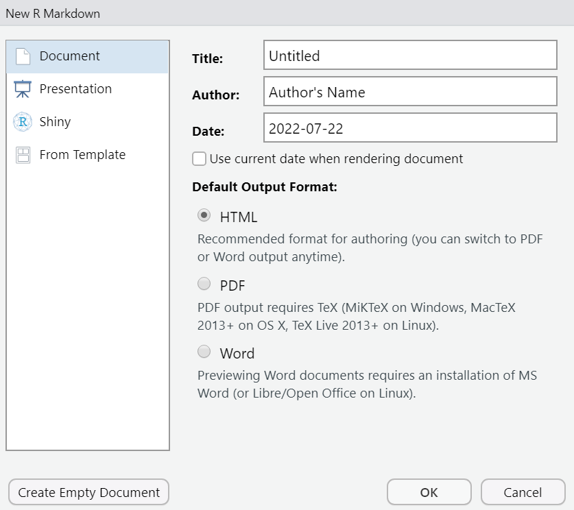
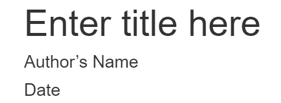
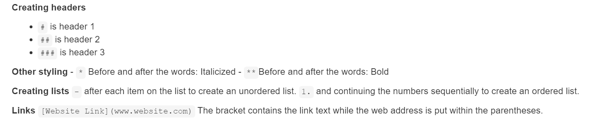
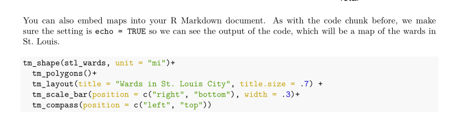
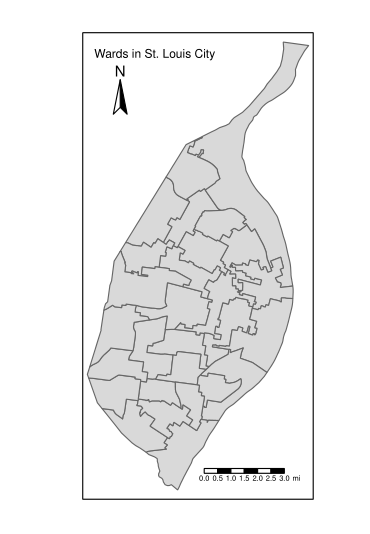
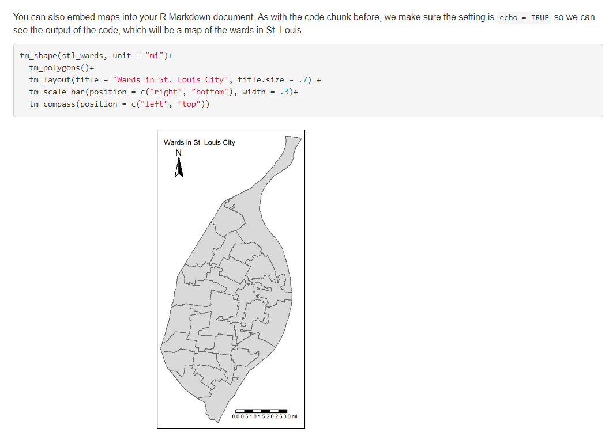
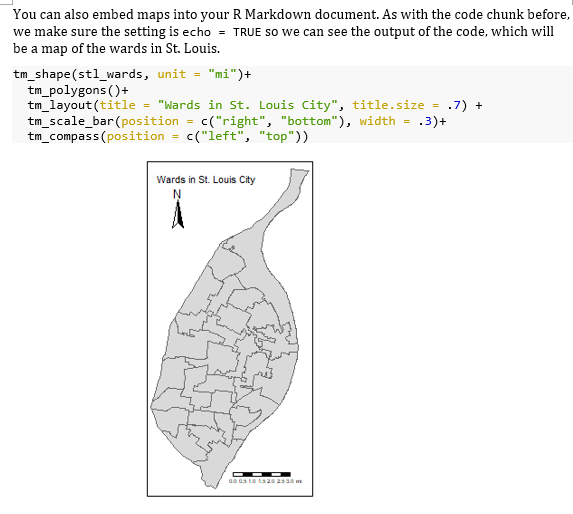
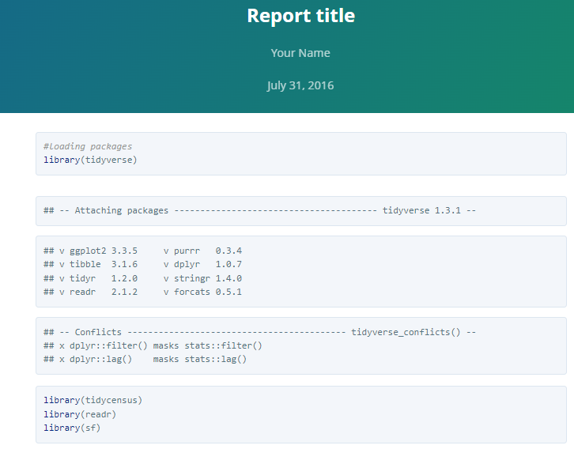
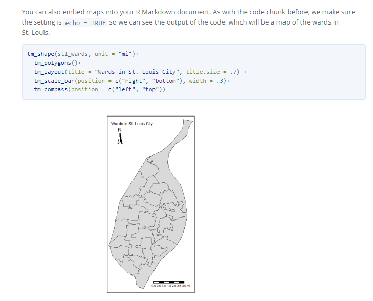

# Creating Dynamic Documents with _rmarkdown_ {#rmarkdown}

## Learning Objectives {#rmarkdown-los}

1.  Reproduce markdown syntax.
2.  Use appropriate code to load data and relevant libraries in RStudio.
3.  Generate code to create and format code chunks.
4.  Modify display options to create a customized R Markdown document.
5.  "Knit" R Markdown documents into various formats.  

## Scenario {#rmarkdown-scenario}
Now that we have a foundation, let's use everything we've learned so far to create an R Markdown document with our analyses of the US Census and NYT data, as well as our data visualizations (the plots and maps we created earlier) for the relevant stakeholders.

## Introduction to R Markdown {#rmarkdown-intro}
The _rmarkdown_ package allows you to create various documents such as PDFs, Microsoft Word documents, and HTML files.  You can also create websites, presentations, and dashboards.  You will build on your R Markdown knowledge to create a dashboard in Chapter 9.  R Markdown uses **Markdown syntax**^[https://www.markdownguide.org/getting-started/] to add formatting to plain text documents.  Examples of such formatting are: adding headers, italicizing and bolding text, and adding ordered and unordered lists.  We are not doing a deep dive with R Markdown, but by the time you finish this chapter, you will be up and running with R Markdown in creating a basic document.  For more information about R Markdown, please refer to _R Markdown the Definitive Guide_, by Yihui Xie, J. J. Allaire, and  Garrett Grolemund^[https://bookdown.org/yihui/rmarkdown/].

In addition, R Markdown allows you to include executable code chunks within the R Markdown document.  So what's the point in putting in code chunks within an R Markdown document when you can give someone a file with your code?  Why not use Microsoft PowerPoint and Word instead?  Having the code chunks embedded in the document can serve various purposes.  Suppose you want to create a document or presentation with data visualizations such as bar plots and an explanation of the visualization.  In that case, you can do that all within one ecosystem instead of creating the visualization in another program, saving the image, and then adding it to your document or presentation.  Also, suppose you have to produce regular reports that use continuously updated datasets.  In that case, you can easily update your visualization by merely reloading your updated dataset and publishing it. This is transformative for workflows that entail running the same data analysis on a monthly or annual basis.

## Packages & Datasets Needed {#rmarkdown-pkgs}
For this chapter, you will need to install and load the _tidyverse, tidycensus, readr, sf_, and _tmap_ packages.  To create the R Markdown document, we also need to load the necessary data if it isn't already loaded.  We will be loading the csv files showing the occupations with the lowest unemployment by sex and our shapefiles of the St. Louis wards and Census tracts, which we created in earlier chapters.
```{r}
library(tidyverse)
library(tidycensus)
library(readr)
library(sf)
library(tmap)

# csv files
male_low_unemployment <- read_csv("data/male-low-unemployment.csv")
female_low_unemployment <- read_csv("data/female-low-unemployment.csv")

# shapefiles
stl_wards <- st_read("nbrhds_wards/WARDS_2010.shp")
unemployment_tract <- st_read("unemployment_tract/unemployment_tract.shp")
```

## Creating an R Markdown document {#rmd-create}
You can create an R Markdown document in RStudio by going to File > New File > R Markdown.  You can create a document, presentation, Shiny app, or you can use a specific template.  Keep the defaults selected and click OK.



## R Markdown document structure
Now that we loaded the necessary libraries and data, it's time to talk about the R Markdown document structure.  R Markdown documents consist of three components:
1.  YAML header
2.  R Markdown syntax
3.  Code chunks

### YAML header
YAML, "YAML Ain't Markdown Language," is used in the header to set the parameters.  It contains the metadata on the document.  Here is the default YAML for an R Markdown document:

```{r, eval= FALSE}
---
title: "Enter title here"
author: "Author's Name"
date: "Date"
output: html_document
---

```



This default YAML indicates the title, author, date, and output type.  There are a variety of output options that you can designate in the YAML header.  For example, in the above code, we specified the output as an HTML document.  There are various output options, such as a PDF, Word, or PowerPoint presentation^[https://bookdown.org/yihui/rmarkdown/output-formats.html]. You can also customize your R Markdown document using templates which we will discuss later in this chapter.

### R Markdown syntax
The R Markdown syntax allows you to add specific styling to your document, such as adding headers, italicizing and bolding texts, adding ordered and unordered lists, and adding links.

**Creating headers**

- `#` is header 1
- `##` is header 2
- `###` is header 3

**Other styles**
- `*` Before and after the words: Italicized
- `**`Before and after the words: Bold

**Creating lists**
`-` after each item on the list, create an unordered list.
`1.` and continuing the numbers sequentially to create an ordered list.

**Links**
`[Website Link](www.website.com)`
The bracket contains the link text while we put the web address
within the parentheses. 



### Embedding code 
You can embed code in your R Markdown document by adding code chunks.  You can do this by clicking on the green 'C' icon at the top of the Editing pane, and you can choose to add a code chunk for a variety of coding languages.  You can also manually add the code chunk by typing the code below.

**Code chunk options**
You can set various options related to the code output and the display of the code within `{r}` section of the code chunk.
- `include = FALSE` prevents the code output and code from being shown in the document you create.  Other chunks can still use the output of the code.
- `echo = FALSE` shows the output but not the code. 

Let's show how this works with loading the information about the aldermen.

**Code example with `echo = FALSE`**
```{r, echo = FALSE}
#code example with using echo as FALSE
aldermen_info = read_csv("data/aldermen-contact.csv")
```

**Code example with `echo = TRUE`**
```{r, echo = TRUE}
#code example with using echo as TRUE
aldermen_info = read_csv("data/aldermen-contact.csv")
```
With `echo = FALSE`, you will not see the output of reading in the csv with the alderman contact information, while when `echo = TRUE`, you can see the output. 

Code example with `include = TRUE`
```{r, include = TRUE}
# code example with using include = TRUE 
aldermen_info = read_csv("data/aldermen-contact.csv")
```

Code example with `include = `FALSE`
```{r, include = FALSE}
aldermen_info = read_csv("data/aldermen-contact.csv")
```
When loading the alderman info csv with `include = TRUE`, you will see both the output and the code, but with `include = FALSE`, you will not see either the output or the code. 

## Adding data visualizations to your markdown document {#rmd-plots}
You can also embed data visualizations such as plots and maps into R Markdown.  Let's embed the plot we made in the ggplot chapter in our R Markdown document.  We added a code chunk and made sure `echo = TRUE` to see the code output.

**Plot of the top ten female occupations in Census tracts with lowest unemployment**
```{r, echo= TRUE}
low_unemployment_female_plot <- female_low_unemployment %>%
  ggplot(aes(x = total, y = reorder(female_jobs, total))) +
  geom_col() +
  labs(
    title = "Top 10 female jobs in areas with low unemployment",
    x = "Total",
    y = "Occupation"
  )

low_unemployment_female_plot
```

You can also embed maps into your R Markdown document.  As with the code chunk before, we make sure the setting is `echo = TRUE` so we can see the output of the code, which will be a map of the wards in St. Louis.

```{r, echo=TRUE}
tm_shape(stl_wards, unit = "mi") +
  tm_polygons() +
  tm_layout(
    title = "Wards in St. Louis City",
    title.size = .7
  ) +
  tm_scale_bar(position = c("right", "bottom"), width = .3) +
  tm_compass(position = c("left", "top"))
```

## Creating your output {#rmd-output}
You know how to add stylistic elements and code to your RMarkdown document, but how do you transform the R Markdown syntax and chunks in your R Markdown file to an output document like a PDF or Word file?  Rendering is the process of converting the R Markdown syntax and code chunks into a document.  The _knitr_ package is required to do this rendering.  There are two ways in which you can do the rendering.  When you create an R Markdown document in RStudio, you will see a Knit button in the document toolbar.  If you press the arrow next to the Knit icon, you will see options to Knit to PDF, Knit to HTML, and Knit to Word.  One thing to note is that if you want to create a PDF document, you must install the _tinytex_ package by typing `tinytex::install_tinytex()`.  Here are examples of the various output options displaying the same content in the markdown document.

**Knit to PDF**




**Knit to HTML**


**Knit to Word**


## Customizing your R Markdown document with templates {#rmd-customize}
You can customize your R Markdown document through a template you create on your own or through a pre-built template and call it through the "output" parameter in the YAML headers.  We will focus on using a pre-built template.  You can look at examples of R Markdown templates on the R Markdown gallery^[https://rmarkdown.rstudio.com/gallery.html].  There are existing templates you can choose from when you create a new R Markdown document, and you can also add a template by changing the output parameter of the YAML header. 

Let's add one of the prettydoc^[https://prettydoc.statr.me/themes.html] templates called 'architect' to your R Markdown document. 
```{r, eval= FALSE}
---
title: "Report title"
author: "Your Name"
date: July 31, 2016
output:
 prettydoc::html_pretty:
    theme: cayman
    highlight: github
---
```





## Summary {#rmd-summary}
R Markdown is a way to create various types of documents in RStudio.  Using the Markdown language, it can be used to format plain text documents.  An R Markdown document comprises a YAML header containing the metadata, R Markdown syntax allowing you to add stylistic elements in the document, and code chunks.  When adding code chunks, you can choose whether to display the code chunks along with the output.  After creating your R Markdown document, you can create a Word, PDF, or HTML document through knitting.  Knitting converts R Markdown into the output format designated in the YAML header.

## Resources {#rmd-resources}
  * The R Markdown website: https://rmarkdown.rstudio.com
  * _R Markdown, The Definitive Guide_: https://bookdown.org/yihui/rmarkdown/

## Further Practice {#rmd-practice}
  * Create an R Markdown document and add a prettydoc template.  Try changing the default YAML output to the other two prettydoc templates, which are `cayman` and `tacticle.`
  * Posit PBC staff have created a new publishing format that works with many programming languages in addition to R, called Quarto.  Using the documentation at https://quarto.org/, install the quarto package^[https://cran.r-project.org/web/packages/quarto/index.html] and recreate your R Markdown document using Quarto.
