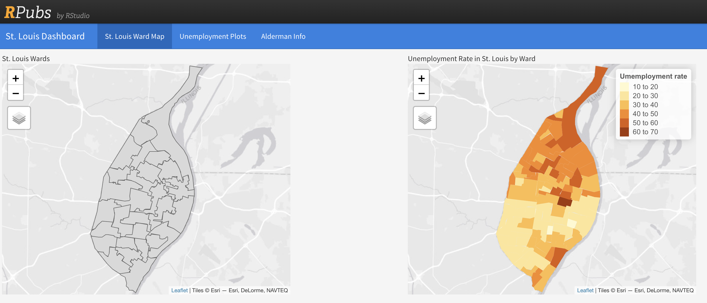
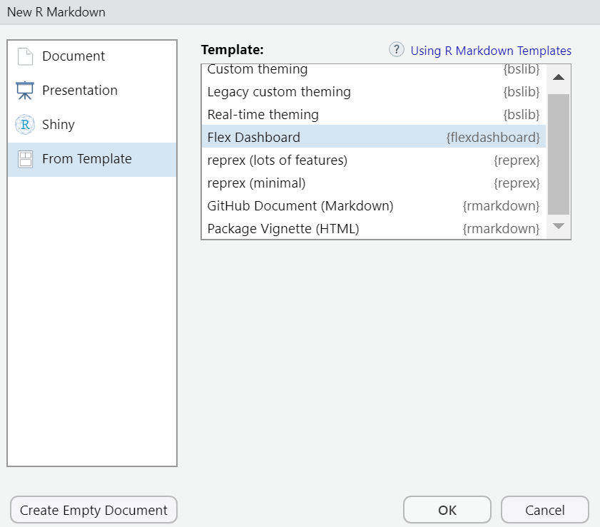
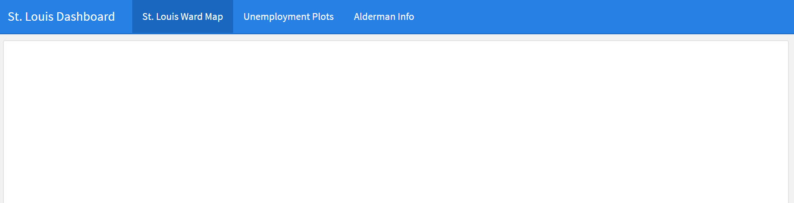
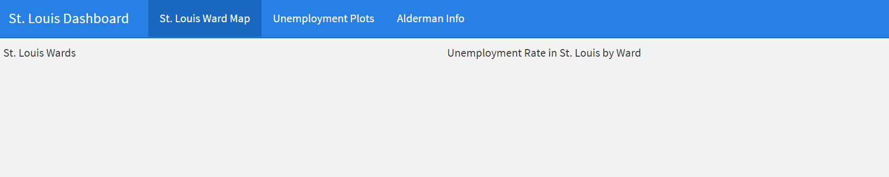
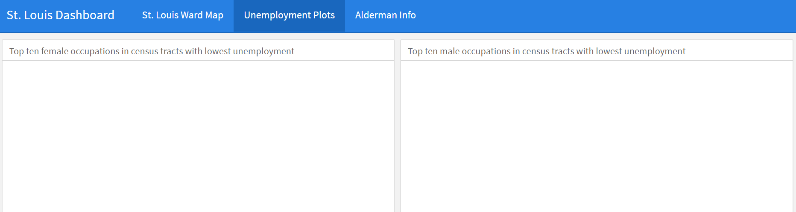
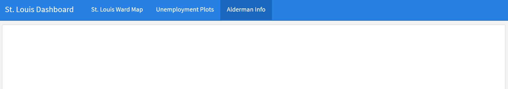
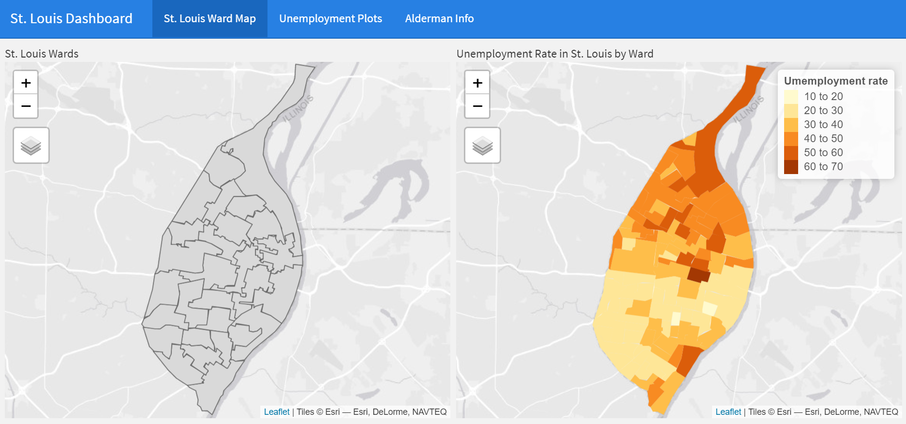
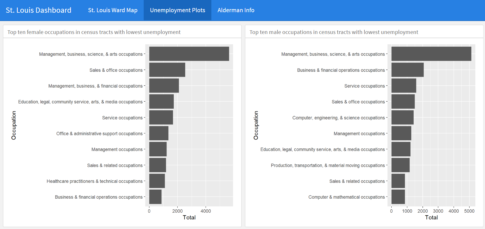
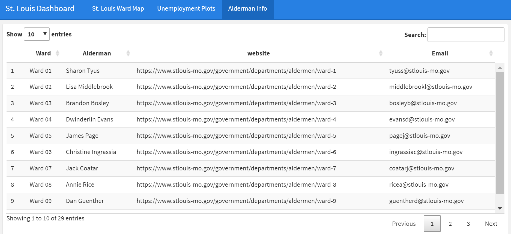

# Creating a flexdashboard {#flexdashboard}

## Learning Objectives {#flexdashboard-los}

1. Define a flexdashboard and the basic functionality of a flexdashboard.
2. Generate an R Markdown document with flexdashboard as the output format.
3. Recognize various layout structures of the flexdashboard in terms of column and row orientation.
4. Create a flexdashboard with a provided layout.

## Terms You'll Learn {#flexdashboard-terms}
  * Flexdashboard
 
## Scenario {#flexdashboard-scenario}
Now that you know how to do various tasks with R such as data scrubbing and creating different data visualizations, you need to create a dashboard so the stakeholders can be able to easily access the information you've presented. You will use the _flexdashboard_ package to do so. Your final product should look like this example from rpubs.com^[RPubs is a free hosting platform for R Markdown documents provided by Posit, PBC]: https://rpubs.com/sarahemlin/stl-dashboard.



*Note: You should create a blank R-Markdown document when creating this dashboard because the elements of the dashboard will not run within the chapter.*

## Overview of flexdashboard {#flexdashboard-intro}
_flexdashboard_ allows you to create a dashboard using R Markdown. It is a flexible interface that allows you to create a dashboard of various data visualizations into one interface. The main components of a flexdashboard consists of pages, columns, and rows. Within these components, you can insert various elements such as tabular output, graphical output or interactive data visualizations that run under the JavaScript programming language^[https://pkgs.rstudio.com/flexdashboard/index.html].

## Packages and datasets needed {#flexdashboard-pkgs}
We are going to load several familiar packages such as _tidyverse_, _tmap_, and _sf_, with the addition of two new packages which are _DT_ and _flexdashboard_. 

```{r pkgs-flexdashboard, message=FALSE, error=FALSE}
library(tidyverse)
library(flexdashboard)
library(tmap)
library(sf)
library(DT)
```

We are also going to load the data that we used in the previous chapters.  This includes the csv files of the alderman contact information and the male and female unemployment information, along with the shapefiles of the St. Louis wards and Census tracts. We also need to do a simple data transformation to calculate the unemployment rate using the _dplyr_ `rename()` and `mutate()` functions.

```{r loading-data, include = FALSE}
aldermen_info <- read_csv("data/aldermen-contact.csv")
male_low_unemployment <- read_csv("data/male-low-unemployment.csv")
female_low_unemployment <- read_csv("data/female-low-unemployment.csv")

stl_wards <- st_read("nbrhds_wards/WARDS_2010.shp")
stl_tracts <- st_read("unemployment_tract/unemployment_tract.shp") %>%
  rename("unemployment_rate" = "unmply_") %>%
  mutate(unemployment_rate = unemployment_rate * 100)
```

## Initiating the flexdashboard {#flex-initiate}
There are two ways in which you can initiate a flexdashboard. One way is to create it from the File tab in RStudio by going to File > New File > R Markdown >  From Template.


Another way we can create a flexdashboard is to create an R Markdown document and then specify the flexdashboard as output in the YAML header.

```yaml
---
title: "St. Louis Dashboard"
output: flexdashboard::flex_dashboard
---
```

## Creating the pages {#create-pages}
First, we will create three pages in our dashboard: the St. Louis ward maps, unemployment plots, and alderman information.

```markdown
St. Louis Ward Map
===================================


Unemployment Plots
===================================

Alderman Info
===================================
```



## Creating the columns {#create-columns}
To do an easy comparison, we will place the maps in the **St. Louis Ward Map** page and the plots in the **Unemployment Plots** page side by side. We will do this by adding columns to both these pages. We will not add any columns to the **Aldermen Info** page.

```markdown 
St. Louis Ward Map
===================================

Column 1
-----------------------------------
St. Louis Wards


Column 2
------------------------------------
Unemployment Rate in St. Louis by Ward


Unemployment Plots
===================================


Column 1
-----------------------------------

### Lowest unemployment (female)


Column 2
-----------------------------------
### Lowest unemployment(male)


Alderman Info
===================================
```







## Adding the code chunks {#adding-code}
We will then put the title of the column sections and code chunks below these column designations. For the Alderman info page, we are using the `datatable` function to display the table of alderman contact information. We will remove the titles of the unemployment plots added with _ggplot2_ since we already have a column title for each plot.

````markdown
`r xfun::file_string('examples/stl_dashboard_ex1.Rmd')`
````



   



## Summary {#flexdashboard-summary}
You can use R Markdown to create dashboards with the _flexdashboard_ package. With the _flexdashboard_ package, we can create dashboards that have different pages and we can add columns to those pages. In this chapter, we created a St. Louis Dashboard with three pages for the St. Louis ward maps, unemployment plots, and aldermen information.

## Further practice {#flexdashboard-study}
  * You can apply various themes^[https://rstudio.github.io/flexdashboard/articles/theme.html] to your Flexdashboard. Try to apply a theme to the St. Louis Dashboard.
  * You will need to add a page that has an R markdown document summarizing your findings. Create another tab called "Report" and put your summary in this section.
  * Create a free account on https://rpubs.com and publish your Flexdashboard using the blue "Publish" button in the upper right of the preview pane.

## Resources {#flexdashboard-resources} 
  * __flexdashboard_ packages website: https://pkgs.rstudio.com/flexdashboard/index.html
  * Specific dashboard instructions from "Dashboard basics": https://pkgs.rstudio.com/flexdashboard/articles/flexdashboard.html 
