# Creating an interactive dashboard with _shiny_ {#shiny}

## Learning Objectives {#shiny-los}

1. List the basic components of a Shiny app.
2. Explain the functions of the user interface and the server.
3. Describe reactivity in Shiny apps. 
4. Generate code in the Shiny user interface to access the provided data.
5. Generate code to in the Shiny server function to access the provided data.

## Terms You'll Learn {#shiny-terms}
  * Reactivity

## Context {#shiny-scenario}
Now that you created the Flexdashboard, you want to have some interactivity in your dashboard such as the users being able to provide input which would change the plots or the maps. You heard that you would be able to do that using the _shiny_ package.

## Packages and datasets needed {#shiny-pkgs}
We will be using the same packages and data from the chapter on flexdashboard with the addition of _shiny_. 

```{r load-shiny-pkgs, message=FALSE, error=FALSE}
# loading libraries
library(tidyverse)
library(flexdashboard)
library(tmap)
library(sf)
library(DT)
library(shiny)
```

```{r global, include = FALSE}
aldermen_info <- read_csv("data/aldermen-contact.csv")
male_low_unemployment <- read_csv("data/male-low-unemployment.csv")
female_low_unemployment <- read_csv("data/female-low-unemployment.csv")

stl_wards <- st_read("nbrhds_wards/WARDS_2010.shp")
stl_tracts <- st_read("unemployment_tract/unemployment_tract.shp") %>%
  rename("unemployment_rate" = "unmply_") %>%
  mutate(unemployment_rate = unemployment_rate * 100)
data <- stl_wards
```

## What you need to know about shiny {#shiny-intro}
The purpose of this chapter is to get you up and running with using _shiny_ by introducing you to the most essential concepts of a Shiny web application and the basic components. By the end of this chapter, you will be able to develop a simple Shiny app that is interactive between tabular data and data visualizations. This is in no way a thorough introduction to Shiny. For a more extensive introduction, please read _Mastering Shiny_^[https://mastering-shiny.org/basic-app.html] by Hadley Wickham. 

In short, _shiny_ is a package that allows you to create interactive web applications For example, you can create a simple web application of an interactive plot that can change by what the users select with a dropdown menu. One example of this is the Telephones by Region^[https://shiny.rstudio.com/gallery/telephones-by-region.html] app on the online Shiny Gallery.

Shiny apps are composed of three parts, which are the user interface (UI), the server, and the `shinyApp` function. The UI is what the user will see on the front end and it is where you build the look of the app. In the UI, you can add various elements that will allow the user to interact with the app such as buttons, sliders, and drop down menus along with the display of your data visualization or data table. On the back end, the server controls what the app will do.  For example, it handles what happens when a user interacts with the app such as pressing a button. The interaction between the UI and server is based on reactivity in which the outputs update based on the input [@wickham2021]. This concept of reactivity will become more clear as we build our app. To put these both together, so you can deploy your app you need to call the `shinyApp` function. Let's first create shiny apps of each component of the dashboard, and then we will integrate these apps in the Flexdashboard that you created. 

## Creating a Shiny web map app {#shiny-map-app}

###  Initalizing from RStudio
In RStudio, you can create a Shiny app by going to File > Shiny Web App. You will be prompted to give an application name and application type. Name the app "stl_web_map" and select the Single File (app.R) type since we are creating a small app. The Multiple File(ui.R/server.R) type is best when you are creating larger shiny apps^[https://shiny.rstudio.com/articles/two-file.html]. To get started, we need to create the user interface and the server functions.
```{r shiny_app, eval= FALSE}
# creating the ui
ui <- fluidPage()

# creating the server
server <- function(input, output) {
}

# running the app
shinyApp(ui = ui, server = server)
```

Initially, the output will be blank since we haven't added any elements.  One we've started, we need to add a dropdown menu which will allow us to select what layers we want to see on the map. First, create a variable called "layers" which will contain the dropdown menu choices which are "Select a variable," "Unemployment rate by ward," and "St. Louis Wards." After that, call the `selectInput` function which contains the name in which we will refer the dropdown menu when we need to call it in the server, the title of the dropdown menu bar, along with our choices. By default, the first option, "Select a variable" is selected. 

```{r shiny_ui, eval=FALSE}

layers <- c(
  "Select a variable",
  "Unemployment rate by ward",
  "St. Louis Wards"
)

# creating the ui
ui <- fluidPage(
  selectInput(
    "var",
    "St. Louis Maps",
    choices = layers,
    selected = layers[1]
  )
)

# creating the server
server <- function(input, output) {
}

# running the app
shinyApp(ui = ui, server = server)
```

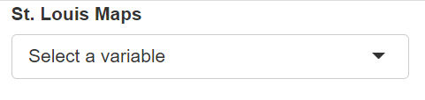

Next, we will create the back-end functionality of the app in the server. First, let's add code which will display, or render, the map. We do that by using the `tmapOutput` function and giving that output a name which we can refer to when creating the reactive variables. After the `tmapOutput` function, we define the reactive variable `output$map` which allows the map to be instantly updated based on the user's input. Since we are rendering a map based on the _tmap_ package, we will be using the `renderTmap` function. Some of the following code should be familiar: we are creating a _leaflet_ map which will build the map based on the St. Louis ward polygons. The one addition is setting the z-index in `tm_polygons`. A z-index specifies the order of overlapping HTML elements. The z-index is set to the layer number plus 400^[https://cran.r-project.org/web/packages/tmap/tmap.pdf].

```{r shiny_server, eval= FALSE}

layers <- c(
  "Select a variable",
  "Unemployment rate by ward",
  "St. Louis Wards"
)

# creating the ui
ui <- fluidPage(
  selectInput(
    "var",
    "St. Louis Maps",
    choices = layers,
    selected = layers[1]
  )
)

# creating the server
server <- function(input, output) {
  # this is the map that will load
  tmapOutput("map")

  output$map <- renderTmap({
    tmap_mode("view")
    tm_shape(data, unit = "mi") +
      tm_polygons(zindex = 401)
  })
}

# running the app
shinyApp(ui = ui, server = server)
```

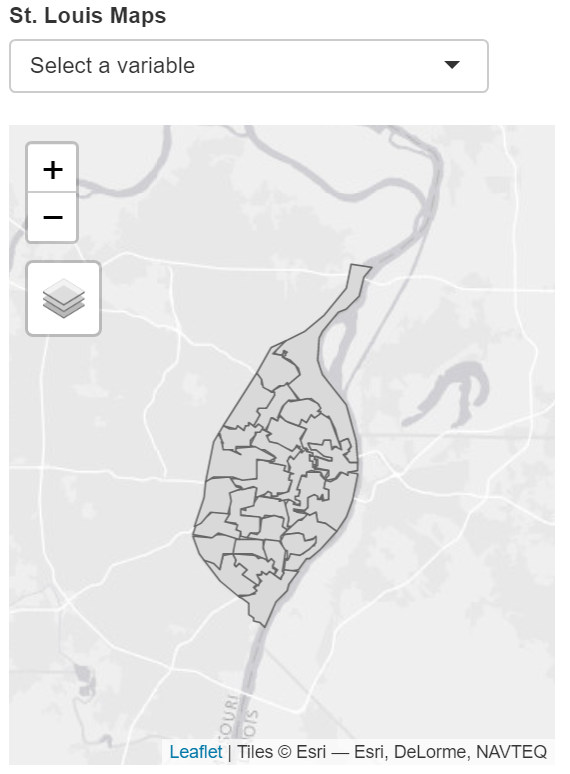

The next thing we are going to do is add reactivity to the app by adding the `observeEvent` function.  We want the app to update based on the selection in the drop-down menu. The `observeEvent` function will run a segment of code based on the reactive variable that is selected which will create the output [@wickham2021]. We also add `if` statements to complement the `observeEvent` function, in order to run certain code chunks based on a specific condition (selected in the dropdown menu). A good way to remember reactivity is that reactive variables are dynamic inputs, while observers are dynamic outputs.  

```{r reactivity, eval= FALSE}

layers <- c(
  "Select a variable",
  "Unemployment rate by ward",
  "St. Louis Wards"
)

# creating the ui
ui <- fluidPage(
  selectInput(
    "var",
    "St. Louis Maps",
    choices = layers,
    selected = layers[1]
  )
)

# creating the server
server <- function(input, output) {
  # this is the map that will load
  tmapOutput("map")

  output$map <- renderTmap({
    tmap_mode("view")
    tm_shape(data, unit = "mi") +
      tm_polygons(zindex = 401)
  })


  observeEvent(input$var, {
    if (input$var == layers[2]) {
      data <- stl_tracts
      tmapProxy("map", session, {
        tm_remove_layer(401) +
          tm_shape(data) +
          tm_fill("unemployment_rate",
            title = "Umemployment rate",
            popup.vars = c("% unemployed" = "unemployment_rate"),
            id = "NAME"
          ) +
          tm_polygons(zindex = 401)
      })
    }

    if (input$var == layers[3]) {
      data <- stl_wards
      tmapProxy("map", session, {
        tm_remove_layer(401) +
          tm_shape(data) +
          tm_polygons(zindex = 401)
      })
    }
  })
}

# running the app
shinyApp(ui = ui, server = server)
```

Let's break down the `observeEvent` function. As mentioned before, the `observeEvent` function will change the output based on the input. Each visualization has a different way of doing this. In the case of _tmap_, the `tmapProxy` function will update the map once various conditions are met. If the user selects the "Unemployment rate by ward" selection (layers[2]), then the `tmapProxy` function will delete the previously displayed layer and add the "Unemployment rate by ward" layer. If the user selects the "St. Louis Wards" (layers[3]) option, then the `tmapProxy` will update the map to show that layer. The way the layer is removed is through calling the z-index of the layer that is being displayed, which is 401 in this case.

We are done creating this app! Run it to see what it looks like. 

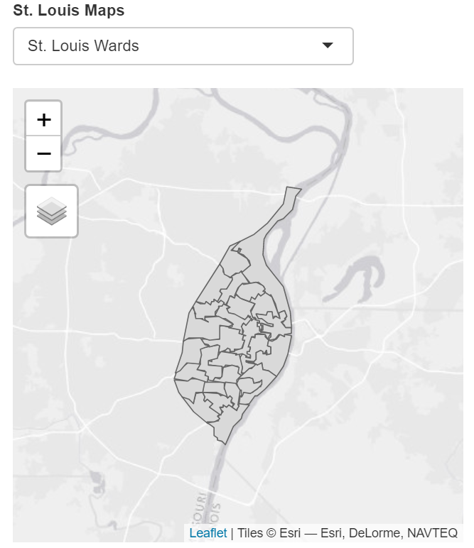  

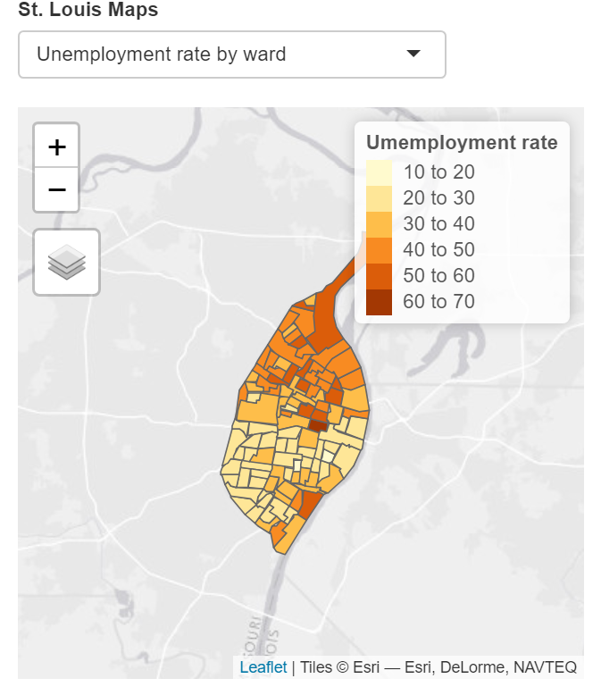

## Creating a `ggplot` Shiny app {#shiny-app}
Now that we have created the Shiny mapping app, let's go ahead and create an interactive plotting app. Make sure to create a new file to create the new Shiny app by going to File > New File > Shiny Web App.

We are not going to go step by step with this app, because the steps are the same as above except for two substitutions: we will use a different output function to display the visualization (`plotOutput()`) and a different render function to display the plot (`renderPlot()`).

```{r shiny_server2, eval= FALSE}

stl_plot_choices <- c(
  "Choose a plot",
  "Occupations with the lowest unemployment (female)",
  "Occupations with the lowest unemployment (male)"
)

# creating the ui
ui <- fluidPage(
  selectInput(
    "plots",
    "Plots",
    choices = stl_plot_choices,
    selected = stl_plot_choices[1]
  )
)

# creating the server
server <- function(input, output) {
  # this is the plot that will load
  plotOutput("plot")
  output$plot <- renderPlot({
    ggplot(female_low_unemployment, aes(
      x = total,
      y = reorder(female_jobs, total)
    )) +
      geom_col() +
      labs(
        title = "Top 10 female jobs in areas with low unemployment",
        x = "Total",
        y = "Occupation"
      )
  })

  observeEvent(input$plots, {
    if (input$plots == stl_plot_choices[2]) {
      output$plot <- renderPlot({
        ggplot(female_low_unemployment, aes(
          x = total, y =
            reorder(female_jobs, total)
        )) +
          geom_col() +
          labs(
            title = "Top 10 female jobs in areas with low 
              unemployment",
            x = "Total",
            y = "Occupation"
          )
      })
    }

    if (input$plots == stl_plot_choices[3]) {
      output$plot <- renderPlot({
        ggplot(male_low_unemployment, aes(
          x = total,
          y = reorder(male_jobs, total)
        )) +
          geom_col() +
          labs(
            title = "Top 10 male jobs in areass with low 
              unemployment",
            x = "Total",
            y = "Occupation"
          )
      })
    }
  })
}

# running the app
shinyApp(ui = ui, server = server)
```
In this app, in the UI function, the `stl_plot_choices` variable stores the drop-down menu options which are "Choose a plot", "Occupation with the lowest unemployment (female)", and "Occupation with the lowest unemployment (male)" which is called in the `selectInput` function. The option that is selected by default is "Choose a plot." On the server side, the `plotOutput` function displays the plot, which is creatively called "plot." Through the `renderPlot` function, the default plot that is loaded before any selection is made will be the "Occupation with the lowest unemployment (female)" plot. The `observeEvent` plot allows the plot that is being displayed in the app to be updated based on the user selection. To enable this, we have two `if` statements in which if the user chooses `stl_plot_choices[2]`(Occupation with the lowest unemployment (female) plot), then it will display or `stl_plot_choices[3]` Occupation with the lowest unemployment (male) plot), then the specific `renderPlot` function  will run.

Now that we are finished with this app, run the app to see how it looks.

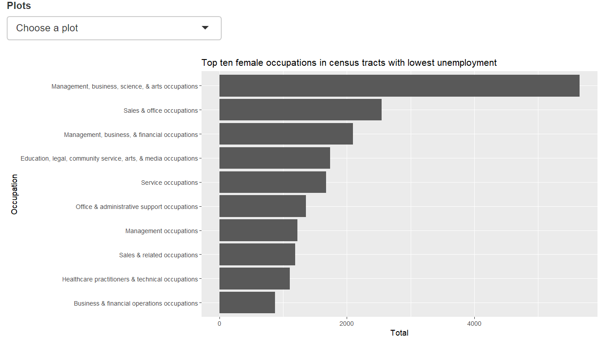

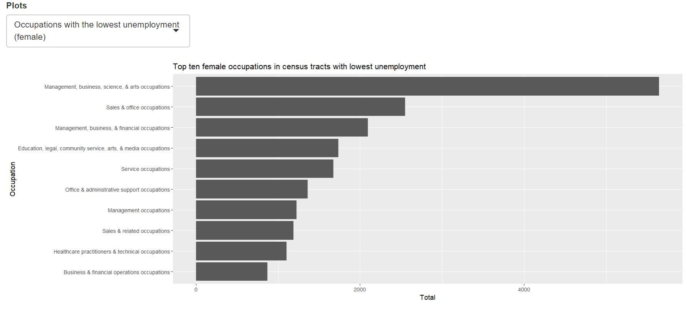


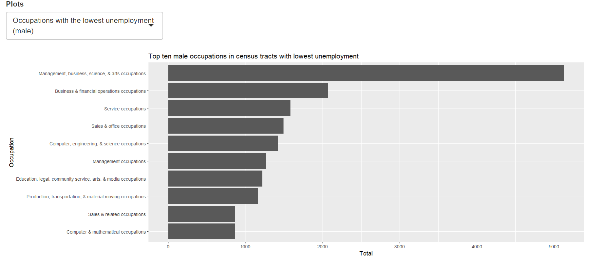


## Integrating Shiny apps into a FlexDashboard {#integrating-shiny}

Now we are going to put these Shiny apps into the FlexDashboard that we created in the previous chapter. We will do this by putting the UI function in the sidebar and putting the server function in the second column that shows our output. First, we will do it with the Shiny mapping app. Let's put the UI in the sidebar of the St. Louis Ward Maps page:

````markdown
`r xfun::file_string('examples/stl_shiny_dashboard_ex1.Rmd')`
````

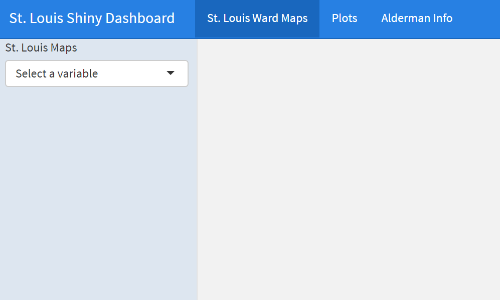

Now, let's add the server function into the second column of the St. Louis Ward Maps page.

````markdown
`r xfun::file_string('examples/stl_shiny_dashboard_ex2.Rmd')`
````

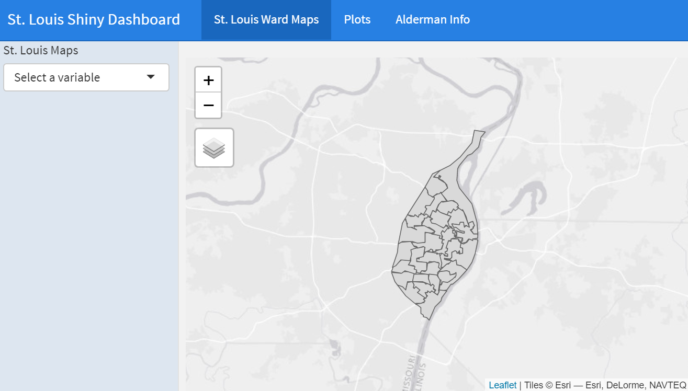

Now that we have finished integrating the Shiny app into the St. Louis Ward Maps section, we will now do the same for the Plots page. Let's first add the UI into the sidebar.

````markdown
`r xfun::file_string('examples/stl_shiny_dashboard_ex3.Rmd')`
````

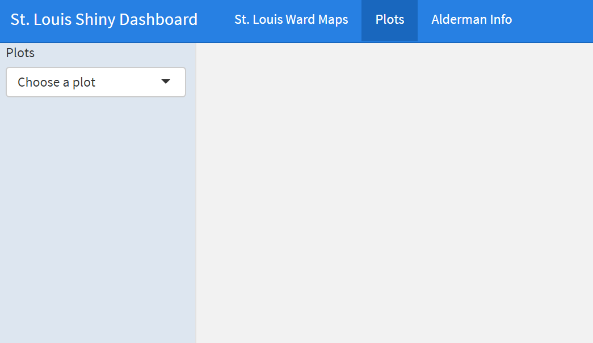

Now we will add the server to the second column which will show our main output. 

````markdown
`r xfun::file_string('examples/stl_shiny_dashboard_ex4.Rmd')`
````

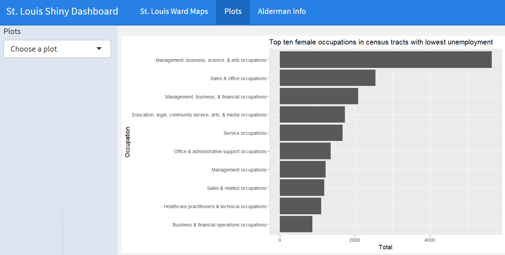

We will not make any changes to the Alderman page. 

````markdown
`r xfun::file_string('examples/stl_shiny_dashboard_ex5.Rmd')`
````

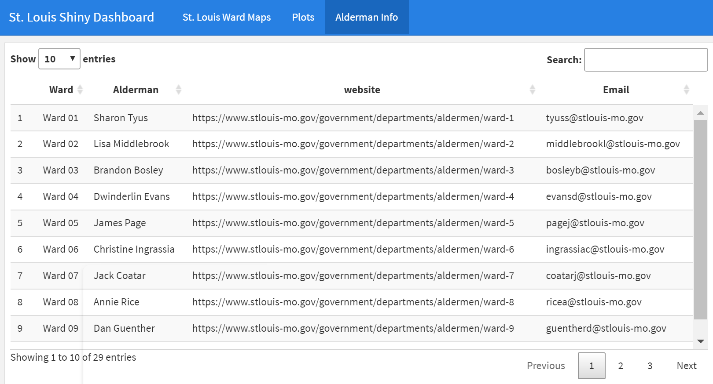

Congratulations, you have created a FlexDashboard which integrates Shiny apps!  You can refer to the `stl_dashboard_shiny.Rmd` file to see the finished product.

## Summary {#shiny-summary}
The _shiny_ package allows you to create interactive web applications. The foundation of Shiny applications is based on reactivity in which the output will update based on the input. The two components of a Shiny app is the user interface, known as the UI and the server. The UI which displays the various elements such as selection bars, plots, maps, or tables, while the server manages the functionality of the app in terms of reactivity. We updated our flexdashboard to include various Shiny apps such as a map with drop-down menus to display either St. Louis wards or unemployment rate by ward. In addition, we added a Shiny app of a plot which also has a drop-down menu of displaying occupations in Census tracts that has the lowest unemployment by male and female occupations. We left the data table for the aldermen information unchanged.

## Further practice {#shiny-study}
  * Shiny can become complicated really fast, and one of the best ways to become acquainted with Shiny is to see some examples of Shiny apps. Read Using Shiny with FlexDashboard^[https://rstudio.github.io/flexdashboard/articles/shiny.html], look at some of the Example projects^[https://rstudio.github.io/flexdashboard/articles/examples.html], and explore the source code. From these examples, what else could you envision adding on to the dashboard?

## Resources {#shiny-resources} 
  * Shiny website: https://shiny.rstudio.com
  * _Mastering Shiny_: https://mastering-shiny.org/index.html
  * _tmap_ package documentation: https://cran.r-project.org/web/packages/tmap/tmap.pdf
